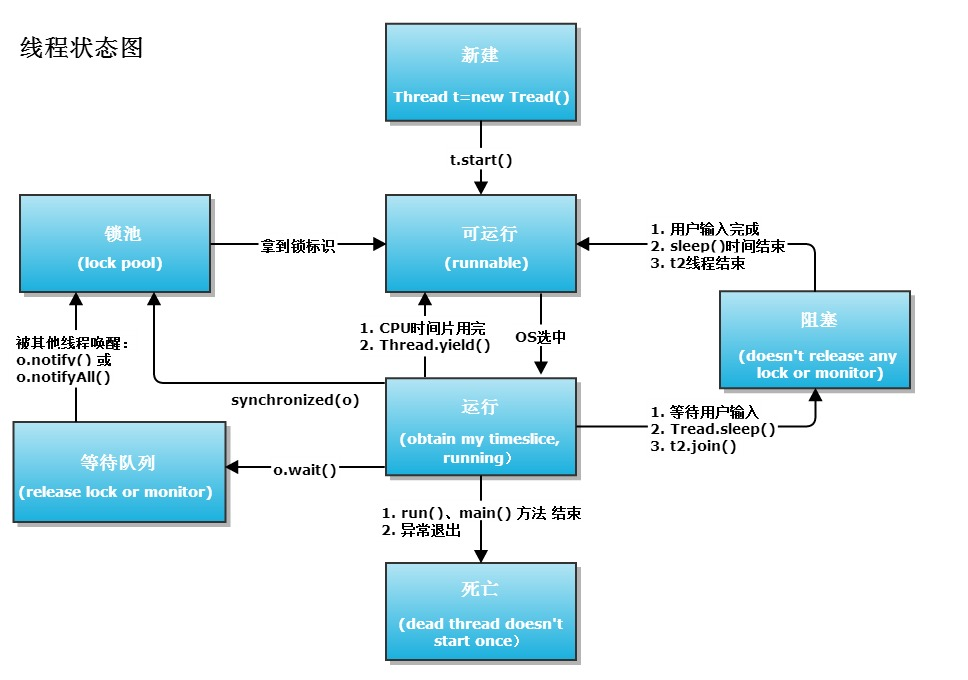

# 并发总览

## 线程安全-互斥

* [原子性](https://lotabout.me/2020/Java-Concurrency-0-Shared-Mutable-State/)：lock
* 可见性、顺序性规则： java 内存模型、cas

## 线程同步-通信
* 管程： 同步锁，lock+condition

## 任务调度-分工
* 线程池：生产者消费者的并行实现
* 
## 设计模式

## 并发编程模型
### 进程交互
* 共享内存
* 消息传递
  * [akka](https://akka.io/)
  * [go-csp](https://time.geekbang.org/column/article/100098)
* [并行编程模型分类-wiki](https://zh.wikipedia.org/wiki/%E5%B9%B6%E8%A1%8C%E7%BC%96%E7%A8%8B%E6%A8%A1%E5%9E%8B)
* [四种并发编程模型](https://sq.163yun.com/blog/article/192782824730734592?tag=M_tg_139_65)
* [多线程并发实践](https://juejin.im/post/59c4ba6f5188254f962cc934)
* javap -verbose java.class
* 并发编程有多种风格，除了CSP(通信顺序进程)、Actor等模型外，大家最熟悉的应该是基于线程和锁的共享内存模型了。

## 反应式编程-Reactive Stream
* 数据结构-数据流（批量，拉）or事件（单一，推）
* 生产者-消费者模式的特性： 解耦，异步非阻塞，平衡线程间或进程间的数据处理速度差异（有利于创建适量的线程数），支持批量执行以提升性能，支持分阶段提交以提升性能，契合发布-订阅模式
* 观察者模式：对象一对多的依赖关系
* Reactive Stream 在某些方面是迭代器模式和观察者模式的结合，同时存在数据的 pull 和 push。订阅者先请求 N 个项目，然后发布者推送最多 N 个项目给订阅者。
* Java 8 引入了 Stream 用于流的操作，Java 9 引入的 Flow 也是数据流的操作。相比之下，Stream 更侧重于流的过滤、映射、整合、收集，而 Flow 更侧重于流的产生与消费。

## [进程和线程之由来](http://www.cnblogs.com/dolphin0520/p/3910667.html)
* 进程让操作系统的并发性成为可能，而线程让进程的内部并发成为可能。
* 一个进程虽然包括多个线程，但是这些线程是共同享有进程占有的资源和地址空间的。进程是操作系统进行资源分配的基本单位，而线程是操作系统进行调度的基本单位。
* Java 中的多线程是抢占式的
## java 堆 和 栈
* [Java堆和栈看这篇就够](https://iamjohnnyzhuang.github.io/java/2016/07/12/Java%E5%A0%86%E5%92%8C%E6%A0%88%E7%9C%8B%E8%BF%99%E7%AF%87%E5%B0%B1%E5%A4%9F.html)
* [Java 堆内存](http://www.blogjava.net/fancydeepin/archive/2013/09/29/jvm_heep.html)
* [Java虚拟机的内存组成以及堆内存介绍](http://www.hollischuang.com/archives/80)
## [ Java内存管理](http://blog.csdn.net/u013142781/article/details/50830754)
## 实现线程的主要3种方式:
使用内核线程实现，使用用户线程实现，使用用户线程加轻量级进程混合实现。
[线程怎么来的](https://mp.weixin.qq.com/s/c_ylY1Iskng7nRFhRT2sKA)
## [Linux探秘之用户态与内核态](http://www.cnblogs.com/bakari/p/5520860.html)

## JMM
*   
 Java内存模型(Java Memory Model，JMM) 是对Java并发编程中线程与内存的关系的定义，即线程间的共享变量存储在主内存（Main Memory） 中，每个线程都有一个私有的本地工作内存（Local Memory），线程的本地内存中存储了该线程使用到的共享变量的副本（从主内存复制而来），线程对该变量的所有读/写操作都必须在自己的本地内存中进行，不同的线程之间也无法直接访问对方本地内存中的变量，线程间变量值的传递需要通过与主内存同步来完成。理解Java内存模型，对于编写正确的Java并发程序来说至关重要。  
[Java内存模型JMM浅析](https://liuzhengyang.github.io/2017/05/12/javamemorymodel/)
* 由于存在指令重排序的原因，所以jmm模型下产生happen-before原则
* happen-before原则是JMM中非常重要的原则，它是判断数据是否存在竞争、线程是否安全的主要依据，保证了多线程环境下的可见性。如果多线程下的代码不符合happen-before原则，既jvm 无法使用happen-before规则的内置实现帮你保证线程安全，必须使用其他手段，来保证线程安全，这样代码执行的结果才正确。
* [java多线程-内存模型](https://mp.weixin.qq.com/s?__biz=MzI3MTQ1NzU2NA==&mid=2247483922&idx=1&sn=eec86f8487432f7ec33b9429c86b38c5&chksm=eac0ce61ddb747776eac465a32fec5f49bbcf9ecd24b555503d4bcd9e5d369fda85945bde19d&mpshare=1&scene=1&srcid=09232nbYtxYmu9O623W83M0s#rd)

## 线程状态转换
* 
[来源](https://my.oschina.net/mingdongcheng/blog/139263)

## syncronized
* 在Java里边就是拿到某个同步对象的锁（一个对象只有一把锁）；  
如果这个时候同步对象的锁被其他线程拿走了，他（这个线程）就只能等了（线程阻塞在锁池等待队列中）。   
取到锁后，他就开始执行同步代码(被synchronized修饰的代码）；  
线程执行完同步代码（方法正常返回或者抛异常而终止）后马上就把锁还给同步对象，其他在锁池中等待的某个线程就可以拿到锁执行同步代码了。   
同时它还可以保证共享变量的内存可见性  
这里也体现了用synchronized来加锁的好处，方法抛异常的时候，锁仍然可以由JVM来自动释放。   
这样就保证了同步代码在同一时刻只有一个线程在执行。
* 在Java程序运行时环境中，JVM需要对两类线程共享的数据进行协调：  
1）保存在堆中的实例变量  
2）保存在方法区中的类变量  
这两类数据是被所有线程共享的。（程序不需要协调保存在Java 栈当中的数据。因为这些数据是属于拥有该栈的线程所私有的。）
* 锁  
普通同步方法，锁是当前实例对象  
静态同步方法，锁是当前类的class对象  
同步方法块，锁是括号里面的对象 
* Java对象头和monitor是实现synchronized的基础
    * synchronized用的锁是存在Java对象头(Mark Word（标记字段）、Klass Pointer（类型指针）)里的
    * Mark Word用于存储对象自身的运行时数据，它是实现轻量级锁和偏向锁的关键
    * Monitor 是线程私有的数据结构，每一个线程都有一个可用monitor record列表，同时还有一个全局的可用列表。每一个被锁住的对象都会和一个monitor关联（对象头的MarkWord中的LockWord指向monitor的起始地址），同时monitor中有一个Owner字段存放拥有该锁的线程的唯一标识，表示该锁被这个线程占用

* jdk1.6对锁的实现引入了大量的优化，如自旋锁、适应性自旋锁、锁消除、锁粗化、偏向锁、轻量级锁等技术来减少锁操作的开销。锁主要存在四中状态，依次是：无锁状态、偏向锁状态、轻量级锁状态、重量级锁状态，他们会随着竞争的激烈而逐渐升级。注意锁可以升级不可降级，这种策略是为了提高获得锁和释放锁的效率。
* 对象锁和类锁：
    * 类锁：对象锁是用来控制实例方法之间的同步，类锁是用来控制静态方法（或静态变量互斥体）之间的同步。其实类锁只是一个概念上的东西，并不是真实存在的，它只是用来帮助我们理解锁定实例方法和静态方法的区别的。我们都知道，java类可能会有很多个对象，但是只有1个Class对象，也就是说类的不同实例之间共享该类的Class对象。Class对象其实也仅仅是1个java对象，只不过有点特殊而已。由于每个java对象都有1个互斥锁，而类的静态方法是需要Class对象。所以所谓的类锁，不过是Class对象的锁而已。获取类的Class对象有好几种，最简单的就是MyClass.class的方式。

    * 一个线程访问静态synchronized的时候，允许另一个线程访问对象的实例synchronized方法。反过来也是成立的，因为他们需要的锁是不同的。
    * synchronized并不能继承，子类覆盖父类synchronized方法时，一定也要在前面加上synchronized关键字；
* 如果这个获取锁的线程由于要等待IO或者其他原因（比如调用sleep方法）被阻塞了，但是又没有释放锁，其他线程便只能干巴巴地等待
* 
* [参考，文中代码示例结果有误，需自己运行查看](http://www.importnew.com/20444.html)

## volatile
* 保证可见性: 保证了不同线程对这个变量进行操作时的可见性，即一个线程修改了某个变量的值，这新值对其他线程来说是立即可见的。

当一个共享变量被volatile修饰时，它会保证修改的值会立即被更新到主存，当有其他线程需要读取时，它会去内存中读取新值。  

而普通的共享变量不能保证可见性，因为普通共享变量被修改之后，什么时候被写入主存是不确定的，当其他线程去读取时，此时内存中可能还是原来的旧值，因此无法保证可见性。  

另外，通过synchronized和Lock也能够保证可见性，synchronized和Lock能保证同一时刻只有一个线程获取锁然后执行同步代码，并且在释放锁之前会将对变量的修改刷新到主存当中。因此可以保证可见性。

* 保证有序性  

1）当程序执行到volatile变量的读操作或者写操作时，在其前面的操作的更改肯定全部已经进行，且结果已经对后面的操作可见；在其后面的操作肯定还没有进行；

2）在进行指令优化时，不能将在对volatile变量的读操作或者写操作的语句放在其后面执行，也不能把volatile变量后面的语句放到其前面执行。

* 不能确保原子性  
    * 原子操作是指不会被线程调度机制打断的操作；这种操作一旦开始，就一直运行到结束，中间不会有任何 context switch 线程切换  
    * 自增操作不是原子性操作，volatile无法保证对变量的任何操作都是原子性的。

* java 中非原子操作：  
    1. 自增，自减，
    2. 变量赋值给变量,例如 i+=n
    3. new 对象实例
    4. 双目运算  

可以通过synchronized或lock，进行加锁，来保证操作的原子性。也可以通过AtomicInteger

* volatile的应用场景  
[参考](http://www.jianshu.com/p/7798161d7472)

## synchronized和volatile比较
1)关键字volatile是线程同步的轻量级实现，性能比synchronized好，且volatile只能修饰变量，synchronized可修饰方法和代码块。  
2)多线程访问volatile不会发生阻塞，synchronized会出现阻塞  
3)volatile能保证数据可见性，有序性（禁止指令重排序）不保证原子性;synchronized可以保证原子性，也可以间接保证可见性，因为synchronized会将私有内存和公共内存中的数据做同步，但不保证有序性，因为存在指令重排序。  
4)volatile解决的是变量在多个线程间的可见性，synchronized解决的是多个线程访问资源的同步性。  
5）原子类:一个原子类型就是一个原子操作可用的类型，可在没有锁的情况下做到线程安全。但原子类也不是完全安全，虽然原子操作是安全的，可方法间的调用却不是原子的，需要用同步。  
[参考：java多线程核心技术梳理(附源码)](https://brianway.github.io/2016/04/18/javase-multithread-programming-reading-note/#线程间通信)

## synchronized和volatile应用场景：单例模式实现中：dcl用法

## CAS :保证一个共享变量的原子操作
* 乐观锁，cas 仅仅是一个原子操作，cas失败则不更新共享变量的值；如果配合循环，可以完成多线程安全操作
* AtomicReference的源码比较简单。它是通过"volatile"和"Unsafe提供的CAS函数实现"原子操作。

(01) value是volatile类型。这保证了：当某线程修改value的值时，其他线程看到的value值都是最新的value值，即修改之后的volatile的值。  
(02) 通过CAS设置value。这保证了：当某线程池通过CAS函数(如compareAndSet函数)设置value时，它的操作是原子的，即线程在操作value时不会被中断。
* AtomicStampedReference
* AtomicIntegerArray
* 
## 线程间通信1：wait 、notify
* 锁池和等待池  
锁池:假设线程A已经拥有了某个对象(注意:不是类)的锁，而其它的线程想要调用这个对象的某个synchronized方法(或者synchronized块)，由于这些线程在进入对象的synchronized方法之前必须先获得该对象的锁的拥有权，但是该对象的锁目前正被线程A拥有，所以这些线程就进入了该对象的锁池中。  
等待池:假设一个线程A调用了某个对象的wait()方法，线程A就会释放该对象的锁后，进入到了该对象的等待池中
* notify和notifyAll  
如果线程调用了对象的 wait()方法，那么线程便会处于该对象的等待池中，等待池中的线程不会去竞争该对象的锁。  
当有线程调用了对象的 notifyAll()方法（唤醒所有 wait 线程）或 notify()方法（只随机唤醒一个 wait 线程），被唤醒的的线程便会进入该对象的锁池中，锁池中的线程会去竞争该对象锁。也就是说，调用了notify后只要一个线程会由等待池进入锁池，而notifyAll会将该对象等待池内的所有线程移动到锁池中，  
等待锁竞争优先级高的线程竞争到对象锁的概率大，假若某线程没有竞争到该对象锁，它还会留在锁池中，唯有线程再次调用 wait()方法，它才会重新回到等待池中。而竞争到对象锁的线程则继续往下执行，直到执行完了 synchronized 代码块，它会释放掉该对象锁，这时锁池中的线程会继续竞争该对象锁。  
注意，任何时候只有一个线程可以获得锁，也就是说只有一个线程可以运行synchronized 中的代码，notifyall只是让处于wait的线程重新拥有锁的争夺权，但是只会有一个获得锁并执行。

* [Java多线程之并发协作生产者消费者设计模式](http://blog.csdn.net/linglongxin24/article/details/52788774)
## 线程间通信2: lock 、Condition
* [Java多线程之并发协作生产者消费者设计模式JDK1.5.0+升级优化版](http://blog.csdn.net/linglongxin24/article/details/52803790)
* 注意，当一个线程获取了锁之后，是不会被interrupt()方法中断的。因为本身在前面的文章中讲过单独调用interrupt()方法不能中断正在运行过程中的线程，只能中断阻塞过程中的线程。  
因此当通过lockInterruptibly()方法获取某个锁时，如果不能获取到，只有进行等待的情况下，是可以响应中断的。    
而用synchronized修饰的话，当一个线程处于等待某个锁的状态，是无法被中断的，只有一直等待下去。

* 不过要注意的是，如果有一个线程已经占用了读锁，则此时其他线程如果要申请写锁，则申请写锁的线程会一直等待释放读锁。如果有一个线程已经占用了写锁，则此时其他线程如果申请写锁或者读锁，则申请的线程会一直等待释放写锁。

* 像synchronized和ReentrantLock都是可重入锁，可重入性在我看来实际上表明了锁的分配机制：基于线程的分配，而不是基于方法调用的分配。举个简单的例子，当一个线程执行到某个synchronized方法时，比如说method1，而在method1中会调用另外一个synchronized方法method2，此时线程不必重新去申请锁，而是可以直接执行方法method2。
* ReentrantLock是一种重入锁。也就是说该锁支持一个线程对资源的重复加锁。在调用lock()方法时，已经获取到锁的线程，能够再次调用lock()方法获取锁而不被阻塞。
我们常见的synchronized也是隐式地支持重复加锁的。比如用synchronized修饰的递归方法。
* 所谓的公平性就是指：哪个线程先请求获取锁，就给哪个线程优先分配锁。也就是等待时间最长的线程优先获取锁。有点类似于队列的FIFO特性。由于要维护公平性原则,公平性的锁效率不如非公平性的锁。但是公平性的锁可以减少饥饿的发生，不至于导致某些线程被饿死
* 参考
    * https://www.cnblogs.com/dolphin0520/p/3923167.html
    * https://www.jianshu.com/p/43e8e3a8b688

## ThreadPoolExecutor 、BlockingQueue
* [线程池的介绍及使用](http://www.cnblogs.com/Seanisme/articles/6164126.html#undefined)

* [Callable、Future、RunnableFuture、FutureTask](https://www.cnblogs.com/nullzx/p/5147004.html)  
Runnable：在run()方法里完成任务，无返回值，且不会抛出异常。  
Callable：在call()方法里完成任务，有返回值，且可能抛出异常。  

## CAS
* [深入浅出CAS](https://www.jianshu.com/p/fb6e91b013cc)

## [ThreadPoolTaskExecutor ](http://ckjava.com/2019/08/22/understand-Spring-ThreadPoolTaskExecutor-ListenableFuture/)

## Semaphore
信号量和管程相比，信号量可以实现的独特功能就是同时允许多个线程进入临界区，但是信号量不能做的就是同时唤醒多个线程去争抢锁，只能唤醒一个阻塞中的线程，而且信号量模型是没有Condition的概念的，即阻塞线程被醒了直接就运行了而不会去检查此时临界条件是否已经不满足了，基于此考虑信号量模型才会设计出只能让一个线程被唤醒，否则就会出现因为缺少Condition检查而带来的线程安全问题。正因为缺失了Condition，所以用信号量来实现阻塞队列就很麻烦，因为要自己实现类似Condition的逻辑。

## 线程数
CPU密集型： CPU 核数 + 1  
IO密集型： 线程数 = CPU 核心数 * (1+ IO 耗时/CPU 耗时) 

