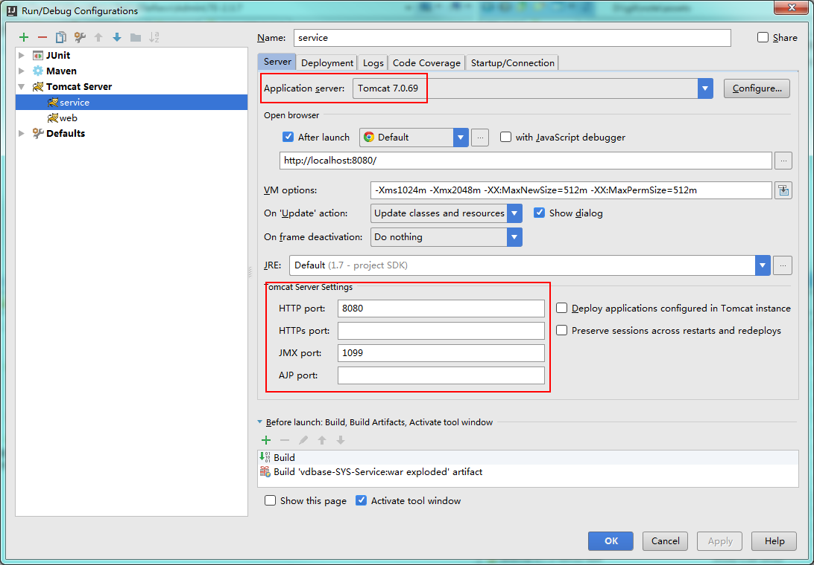
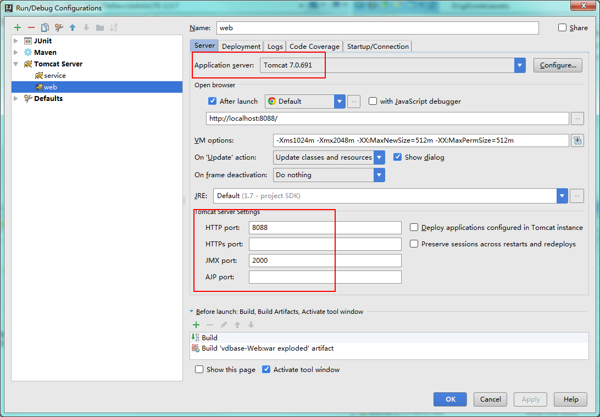

复制一个tomcat目录，并做如下修改，以使两个服务不冲突
1. 修改/bin/startup.bat   
 首行添加 `SET CATALINA_HOME=D:\soft\apache-tomcat-7.0.691`

2. 修改server.xml 三个节点的端口号

```xml
<Server port="8006" shutdown="SHUTDOWN">  
<Connector URIEncoding="UTF-8" connectionTimeout="20000" port="8088" protocol="HTTP/1.1" redirectPort="8443"/>  
<Connector port="8010" protocol="AJP/1.3" redirectPort="8443"/>

```

3. idea 配置server时分别指向两个tomcat目录,并修改端口  





## tomcat 日志乱码
 `bin/catalina.sh`
```
if [ -z "$LOGGING_MANAGER" ]; then
  LOGGING_MANAGER="-Djava.util.logging.manager=org.apache.juli.ClassLoaderLogManager -Dfile.encoding=UTF8 -Dsun.jnu.encoding=UTF8"
fi
```