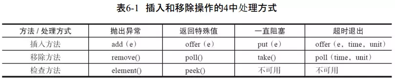

```sh
javac -cp "classpath" *.java
java -cp "classpath" mainClass arg

```

## [基本数据类型转换](https://segmentfault.com/a/1190000015349453)
* 引用数据类型转换  
 所以编译器在编译时只会检查类型之间是否存在继承关系，有则通过；而在运行时就会检查它的真实类型，是则通过，否则抛出ClassCastException异常。所以在继承中，子类可以自动转型为父类，但是父类强制转换为子类时只有当引用类型真正的身份为子类时才会强制转换成功，否则失败。
* 基本数据类型的运算表达式规则  
类型先自动拆箱,然后类型会自动类型提升（自动类型转换）

## jvm
* [虚拟机内存区域](https://www.jianshu.com/p/06a8108aaa25)
* [类加载机制](https://www.jianshu.com/p/1daa180f6b26)
* [对象建立](https://www.jianshu.com/p/301383e97680)  

类构造器<clinit>是由编译器自动收集类中的所有静态变量的赋值动作和静态语句块static{}中的代码合并产生的，编译器收集的顺序是由语句在源文件中出现的顺序所决定的。

总的来说，类初始化的一般过程是：父类的类构造器<clinit>() -> 子类的类构造器<clinit>() -> 父类的成员变量和实例代码块 -> 父类的构造函数 -> 子类的成员变量和实例代码块 -> 子类的构造函数。
* [对象内存布局](https://www.jianshu.com/p/8dbdd6b35826)
* [对象的访问](https://www.jianshu.com/p/e35f20523afb)

## 双端队列
* [ArrayDeque](https://www.jianshu.com/p/7a4b2fdf2823)
## 阻塞队列
* 超时退出   
队列为空时进行出队操作,进行出队操作的线程将被阻塞,直至超时退出(线程也会退出)  
队列已满时进行入队操作,进行入队操作的线程将被阻塞,直至超时退出(线程也会退出)


## java format 
* %[argument_index$][flags][width][.precision]conversion
* [javadoc](https://docs.oracle.com/javase/1.5.0/docs/api/java/util/Formatter.html#syntax)
* [ref](https://dzone.com/articles/java-string-format-examples)

## jar 
* jar命令  
有生成、查看、更新、解开jar包的作用，包含META-INF/MANIFEST.MF文件。
它是jar包生成的时候，自动创建的，主要负责指定jar包的main文件位置和当前文件夹。
```sh
jar --help
Usage: jar {ctxui}[vfmn0PMe] [jar-file] [manifest-file] [entry-point] [-C dir] files ...
Options:
    -c  create new archive
    -t  list table of contents for archive
    -x  extract named (or all) files from archive
    -u  update existing archive
    -v  generate verbose output on standard output
    -f  specify archive file name
    -m  include manifest information from specified manifest file
    -n  perform Pack200 normalization after creating a new archive
    -e  specify application entry point for stand-alone application 
        bundled into an executable jar file
    -0  store only; use no ZIP compression
    -P  preserve leading '/' (absolute path) and ".." (parent directory) components from file names
    -M  do not create a manifest file for the entries
    -i  generate index information for the specified jar files
    -C  change to the specified directory and include the following file
If any file is a directory then it is processed recursively.
The manifest file name, the archive file name and the entry point name are
specified in the same order as the 'm', 'f' and 'e' flags.

Example 1: to archive two class files into an archive called classes.jar: 
       jar cvf classes.jar Foo.class Bar.class 
Example 2: use an existing manifest file 'mymanifest' and archive all the
           files in the foo/ directory into 'classes.jar': 
       jar cvfm classes.jar mymanifest -C foo/ 


```
## [java 反编译 之JAD ](https://varaneckas.com/jad/)
* 下载  
`wget https://varaneckas.com/jad/jad158e.linux.intel.zip`
`unzip jad158e.linux.intel.zip -d jad`
* 安装
无需安装，直接运行
`./jad `  
	1. show error:    
./jad: /lib/ld-linux.so.2: bad ELF interpreter: No such file or directory   
fix： `yum install glibc.i686`  
	2. show error:  
./jad: error while loading shared libraries: libstdc++-libc6.2-2.so.3: cannot open shared object file: No such file or directory  
fix:
`yum -y install compat-libstdc++-296`
* 使用  
`jad -o -r -sjava -dsrc 'tree/**/*.class' `

## [java 反编译之CFR](http://www.benf.org/other/cfr/)
* `wget http://www.benf.org/other/cfr/cfr_0_129.jar`
* `java -jar cfr_0_129.jar --help`
* class  
`java -jar ../pac/cfr_0_129.jar ChildController.class > ChildController.java
`
* jar  
`java -jar cfr_0_129.jar /path/to/aa.jar --outputdir /path/to/aa`

## [java 反编译之 在线](http://www.javadecompilers.com/)
## [Java封箱拆箱的一些问题](https://www.cnblogs.com/xiaozhang2014/p/5347407.html#undefined)

## [JAVA不可变类(immutable)机制与String的不可变性](https://www.cnblogs.com/jaylon/p/5721571.html)

## java equals and hashcode
### 重写equals必须注意：
*   1 自反性：对于任意的引用值x，x.equals(x)一定为true
*   2  对称性：对于任意的引用值x 和 y，当x.equals(y)返回true，y.equals(x)也一定返回true
*   3 传递性：对于任意的引用值x、y和ｚ，如果x.equals(y)返回true，并且y.equals(z)也返回true，那么x.equals(z)也一定返   回 true
* 4 一致性：对于任意的引用值x 和 y，如果用于equals比较的对象信息没有被修改，多次调用x.equals(y)要么一致地返回true，要么一致地返回false
*   5 非空性：对于任意的非空引用值x，x.equals(null)一定返回false
### [7.编写一个完美equals()的几点建议](https://blog.csdn.net/javazejian/article/details/51348320)

* [lombok @EqualsAndHashCode 注解](https://blog.csdn.net/zhanlanmg/article/details/50392266)

下面给出编写一个完美的equals方法的建议（出自Java核心技术 第一卷：基础知识）：

1) 显式参数命名为otherObject,稍后需要将它转换成另一个叫做other的变量（参数名命名，强制转换请参考建议5）

2) 检测this与otherObject是否引用同一个对象 ：if(this == otherObject) return true;（存储地址相同，肯定是同个对象，直接返回true）

3) 检测otherObject是否为null ，如果为null,返回false.if(otherObject == null) return false;

4) 比较this与otherObject是否属于同一个类 （视需求而选择）

	* 如果equals的语义在每个子类中有所改变，就使用getClass检测 ：if(getClass()!=otherObject.getClass()) return false; (参考前面分析的第6点)

	* 如果所有的子类都拥有统一的语义，就使用instanceof检测 ：if(!(otherObject instanceof ClassName)) return false;（即前面我们所分析的父类car与子类bigCar混合比，我们统一了批次相同即相等）

5) 将otherObject转换为相应的类类型变量：ClassName other = (ClassName) otherObject;

6) 现在开始对所有需要比较的域进行比较 。使用==比较基本类型域，使用equals比较对象域。如果所有的域都匹配，就返回true，否则就返回flase。

	* 如果在子类中重新定义equals，就要在其中包含调用super.equals(other)

当此方法被重写时，通常有必要重写 hashCode 方法，以维护 hashCode 方法的常规协定，该协定声明 相等对象必须具有相等的哈希码 。

###  在java中进行比较，我们需要根据比较的类型来选择合适的比较方式：

1) 对象域，使用equals方法 。   
2) 类型安全的枚举，使用equals或== 。   
3) 可能为null的对象域 : 使用 == 和 equals 。 
4) 数组域 : 使用 Arrays.equals 。 
5) 除float和double外的原始数据类型 : 使用 == 。 
6) float类型: 使用Float.foatToIntBits转换成int类型，然后使用==。  
7) double类型: 使用Double.doubleToLongBit转换成long类型，然后使用==。  
* 原始类型和包装类 进行比较时：堆中的Integer自动拆箱（xx.intValue，在栈中创建内存空间，值一样的话内存引用一样）为int类型的数据，然后进行==比较，引用一致
### jdk实现 hashcode 
注意：最好不要用可变的字段来计算哈希码！
计算你所关心的域（在equals起作用的）的 hashCode。
```java
# Objects.hash(values)
public static int hash(Object... values) {
        return Arrays.hashCode(values);
    }
# Arrays.hashCode(values)
public static int hashCode(Object a[]) {
        if (a == null)
            return 0;

        int result = 1;

        for (Object element : a)
            result = 31 * result + (element == null ? 0 : element.hashCode());

        return result;
    }
```

## [java string replace](https://blog.csdn.net/wangpeng047/article/details/8985236)

```txt
1. replace的参数是char和CharSequence，即可以支持字符的替换，也支持字符串的替换（CharSequence即字符串序列的意思,说白了也就是字符串）；

replaceAll的参数是regex，即基于规则表达式的替换，比如：可以通过replaceAll("\\d", "*")把一个字符串所有的数字字符都换成星号；

相同点：都是全部替换，即把源字符串中的某一字符或字符串全部换成指定的字符或字符串；

不同点：replaceAll支持正则表达式，因此会对参数进行解析（两个参数均是），如replaceAll("\\d", "*")，而replace则不会，replace("\\d","*")就是替换"\\d"的字符串，而不会解析为正则。

2. “\”在java中是一个转义字符，所以需要用两个代表一个。例如System.out.println( "\\" ) ;只打印出一个"\"。但是“\”也是正则表达式中的转义字符，需要用两个代表一个。所以：\\\\被java转换成\\，\\又被正则表达式转换成\，因此用replaceAll替换“\”为"\\"，就要用replaceAll("\\\\","\\\\\\\\")，而replace则replace("\\","\\\\")。

3. 如果只想替换第一次出现的，可以使用replaceFirst()，这个方法也是基于规则表达式的替换，但与replaceAll()不同的是，只替换第一次出现的字符串。

```
## JNI
JNI 全称是 Java Native Interface (Java本地接口) 单词首字母的缩写，本地接口就是指用 C 和 C++ 开发的接口。

开发 JNI 程序会受到系统环境的限制，因为用 C/C++ 语言写出来的代码或模块，编译过程当中要依赖当前操作系统环境所提供的一些库函数，并和本地库链接在一起。而且编译后生成的二进制代码只能在本地操作系统环境下运行，因为不同的操作系统环境，有自己的本地库和 CPU 指令集，而且各个平台对标准 C/C++ 的规范和标准库函数实现方式也有所区别。这就造成使用了 JNI 接口的 JAVA 程序，不再像以前那样自由的跨平台。如果要实现跨平台，就必须将本地代码在不同的操作系统平台下编译出相应的动态库(windows：#.dll, linux/unix：lib#.so, mac os x：lib#.jnilib)。

[so 文件](http://aifuns.cc/2017/10/08/so-file-in-C.html)
```java
package com.wander.jni;
public class JNITest {
	static {
		//指定要调用的动态链接库的绝对路径即可，只是在跨平台访问时，需要指定对应平台的文件路径，且不同平台文件的前缀和后缀都不一样；
		//System.load("/Users/wander/MyDocuments/workspace/workspace4eclipse/test-normal-project/res/jni/libJNITest.jnilib");
		//只需要指定动态库的名字即可，不需要前缀后缀，java 会去 java.library.path 系统属性指定的目录下查找动态库文件，一劳永逸；
		//System.getProperty("java.library.path") 和环境变量一样，每个路径用:分割，随便放到哪个路径下都有效。
		System.loadLibrary("JNITest");// 加载实现了native函数的动态库
	}
	public static native String test(String name);// 声明native函数
	public static void main(String[] args) {
		System.out.println(test("wander"));// 调用 native 函数
	}
}
```
* [C++中的头文件和源文件](https://www.jianshu.com/p/9ad662edd6aa)
## 异常
* https://juejin.im/post/5ae66791f265da0b92655c5d

## tomcat servlet-api 版本
* http://tomcat.apache.org/whichversion.html
## ocr 识别
#### tesseract-ocr
* tesseract --list-langs
* tesseract imagename outputbase [-l lang] [-psm pagesegmode] [configfile...]  


### 多线程
* [Java核心技术点之多线程 by absfree](http://www.jianshu.com/p/4b0721633009)


## tomcat 参数配置
* ide 中  
//-Xms1024m -Xmx2048m -XX:MaxNewSize=512m -XX:MaxPermSize=512m  
//-Xms128m -Xmx128m -XX:MaxNewSize=32m -XX:MaxPermSize=32m
* tomcat [参考](http://outofmemory.cn/c/java-outOfMemoryError)  
`JAVA_OPTS="-server -XX:PermSize=512M -XX:MaxPermSize=512m"`
* tomcat   
//URIEncoding="UTF-8"


/*3.变量的运算：
   ①自动类型转换：容量小的数据类型自动转换为容量大的数据类型。
    short s = 12;
     int i = s + 2;
    注意：byte  short char之间做运算，结果为int型！
   ②强制类型转换：是①的逆过程。使用“（）”实现强转。
*/
short s = 10;
s = s + 5;//报编译的异常
s = (short)(s + 5);
s += 5;//s = s + 5，但是结果不会改变s的数据类型。

//2.空指针的异常：NullPointerException
		//第一种：
//		boolean[] b = new boolean[3];
//		b = null;
//		System.out.println(b[0]);

		//第二种：
//		String[] str = new String[4];
//		//str[3] = new String("AA");//str[3] = "AA";
//		System.out.println(str[3].toString());

		//第三种：
		int[][] j = new int[3][];
		j[2][0] = 12;
数组的反转：
// 数组元素的反转
// for(int i = 0;i < arr.length/2;i++){
// int temp = arr[i];
// arr[i] = arr[arr.length-1 - i];
// arr[arr.length - 1 - i] = temp;
// }
for (int x = 0, y = arr.length - 1; x < y; x++, y--) {
	int temp = arr[x];
	arr[x] = arr[y];
	arr[y] = temp;
}
// 使用冒泡排序使数组元素从小到大排列
//		for (int i = 0; i < arr.length - 1; i++) {
//			for (int j = 0; j < arr.length - 1 - i; j++) {
//				if (arr[j] > arr[j + 1]) {
//					int temp = arr[j];
//					arr[j] = arr[j + 1];
//					arr[j + 1] = temp;
//				}
//			}
//		}

//使用直接选择排序使数组元素从小到大排列
//		for(int i = 0; i < arr.length - 1; i++){
//			int t = i;//默认i处是最小的
//			for(int j = i;j < arr.length;j++){
//				//一旦在i后发现存在比其小的元素，就记录那个元素的下角标
//				if(arr[t] > arr[j]){
//					t = j;
//				}
//			}
//			if(t != i){
//				int temp = arr[t];
//				arr[t] = arr[i];
//				arr[i] = temp;
//			}
//		}
还可以调用：Arrays工具类：Arrays.sort(arr);

public String toString() {
        return getClass().getName() + "@" + Integer.toHexString(hashCode());

    }
@Override
	public String toString() {
		return "Season [seasonName=" + seasonName + ", seasonDesc="
				+ seasonDesc + "]";
	}
Set<Map.Entry<String,Integer>> set = map.entrySet();
	for(Map.Entry<String,Integer> o : set){
		System.out.println(o.getKey() + "--->" + o.getValue());
	}

# 枚举类: 类的对象是有限个的，确定的  
1. 如何自定义枚举类。  
   1.1 私有化类的构造器，保证不能在类的外部创建其对象  
   1.2 在类的内部创建枚举类的实例。声明为：public static final  
   1.3 若类有属性，那么属性声明为：private final 。此属性在构造器中赋值。  
2. 使用enum关键字定义枚举类  
2.1其中常用的方法：values()  valueOf(String name);  
2.2枚举类如何实现接口   
①让类实现此接口，类的对象共享同一套接口的抽象方法的实现。  
①让类的每一个对象都去实现接口的抽象方法，进而通过类的对象调用被重写的抽象方法时，执行的效果不同  
```java

public enum UnionWXProduct {
        /**
         * one
         */
        TEST("92728A3497","D4F65ED039",1),
        ONE("7CD3E04665","D4F65ED039",1000),
        /**
         * one
         */
        THREE("CD87268B20","D4F65ED039",3000),
        /**
         * one
         */
        SIX("920CAD691C","D4F65ED039",5000),
        /**
         * one
         */
        YEAR("A6EFB2A0B1","D4F65ED039",10000);


        public static UnionWXProduct getEnum(Object fieldValue){

            for (UnionWXProduct type : UnionWXProduct.values()) {
                if(StrUtil.containsAny(String.valueOf(fieldValue),type.pid,type.getPayId(),String.valueOf(type.totalFee))){
                    return type;
                }
            }
            return null;
        }

        private String pid;
        private String payId;
        private Integer totalFee;

        UnionWXProduct(String pid, String payId, int totalFee) {
            this.pid = pid;
            this.payId = payId;
            this.totalFee = totalFee;
        }

        public String getPid() {
            return pid;
        }

        public String getPayId() {
            return payId;
        }

        public Integer getTotalFee() {
            return totalFee;
        }

        @Override
        public String toString() {
            final StringBuilder sb = new StringBuilder("ZJProduct{");
            sb.append("pid='").append(pid).append('\'');
            sb.append(", payId='").append(payId).append('\'');
            sb.append(", totalFee=").append(totalFee);
            sb.append('}');
            return sb.toString();
        }
    }


public class TestSeason1 {
	public static void main(String[] args) {
		Season1 spring = Season1.SPRING;
		System.out.println(spring);
		spring.show();
		System.out.println(spring.getSeasonName());

		System.out.println();
		//1.values()
		Season1[] seasons = Season1.values();
		for(int i = 0;i < seasons.length;i++){
			System.out.println(seasons[i]);
		}
		//2.valueOf(String name):要求传入的形参name是枚举类对象的名字。
		//否则，报java.lang.IllegalArgumentException异常
		String str = "WINTER";
		Season1 sea = Season1.valueOf(str);
		System.out.println(sea);
		System.out.println();

		Thread.State[] states = Thread.State.values();
		for(int i = 0;i < states.length;i++){
			System.out.println(states[i]);
		}
		sea.show();

	}
}
interface Info{
	void show();
}
//枚举类
enum Season1 implements Info{
	SPRING("spring", "春暖花开"){
		public void show(){
			System.out.println("春天在哪里？");
		}
	},
	SUMMER("summer", "夏日炎炎"){
		public void show(){
			System.out.println("生如夏花");
		}
	},
	AUTUMN("autumn", "秋高气爽"){
		public void show(){
			System.out.println("秋天是用来分手的季节");
		}
	},
	WINTER("winter", "白雪皑皑"){
		public void show(){
			System.out.println("冬天里的一把火");
		}
	};

	private final String seasonName;
	private final String seasonDesc;

	private Season1(String seasonName,String seasonDesc){
		this.seasonName = seasonName;
		this.seasonDesc = seasonDesc;
	}
	public String getSeasonName() {
		return seasonName;
	}
	public String getSeasonDesc() {
		return seasonDesc;
	}

	@Override
	public String toString() {
		return "Season [seasonName=" + seasonName + ", seasonDesc="
				+ seasonDesc + "]";
	}
//	public void show(){
//		System.out.println("这是一个季节");
//	}
}
```

二、注解Annotation
1.JDK提供的常用的三个注解
@Override: 限定重写父类方法, 该注释只能用于方法
@Deprecated: 用于表示某个程序元素(类, 方法等)已过时
@SuppressWarnings: 抑制编译器警告

2.如何自定义注解
以SuppressWarnings为例进行创建即可

3.元注解：可以对已有的注解进行解释说明。
Retention: SOURCE   CLASS  RUNTIME
Target:
Documented:javadoc
Inherited

## servlet


	Web监听器
	用于监听ServletContext，httpSession，ServletRequest等域对象的创建和销毁事件
	监听域对象属性发生修改的事件
	可以在事件发生前，后做一些操作
	优先级  监听器》过滤器》Servlet 其中监听器和过滤器都是按照注册顺序作为启动顺序
	按监听器对象分类    监听应用程序环境对象ServletContext的事件监听器，用户会话对象HttpSession,请求消息对象ServletRequest
	按监听事件分类    监听域对象自身的创建和销毁，域对象中属性的增加和删除，监听HttpSession域中某对象状态
	一对多  参考js事件模型
	 dom 域对象；
	 事件 创建和销毁
	 事件处理  各实现接口listener的方法
	 事件对象 方法参数
	 作用：定时器   全局属性对象
	 HttpSessionListener  统计在线人数  访问日志记录 sessionConfig
	 ServletRequestListener  读取参数  记录访问历史  先Requestinit  sessioncreate  Requestdestroy

	 以及域对象中各属性的增加，删除和替换注意要和域对象的生命周期结合使用

	 session钝化机制：把服务器中不经常使用的session对象暂时序列化到系统文件或数据库中，当被使用时反序列化到内存中，整个过程有服务器自动完成
	 钝化后的文件保存在：安装路径apache-tomcat-8.0.24\work\Catalina\localhost\项目名\SESSION.ser 当重新启动时，加载并删除
	 session钝化机制由sessionManager管理
	 standardManager和persistentManager默认情况下tomcat提供两个钝化驱动类FileStor  和JDBCStore

	 该监听器不需要在web.xml中注册，且是普通的javabean去继承HttpSessionBindingListener
	 httpsessionactivationListener 以及实现  serialation接口

/*
-Xms2048m -Xmx4096m -XX:MaxNewSize=512m -XX:MaxPermSize=512m

URIEncoding="UTF-8"
 */

 ## 内部类
 ```java
 public interface Father {

 }

 public interface Mother {

 }

 public class Son implements Father, Mother {

 }

 public class Daughter implements Father{

     class Mother_ implements Mother{

     }
 }
 ```
> 其实对于这个实例我们确实是看不出来使用内部类存在何种优点，但是如果Father、Mother不是接口，而是抽象类或者具体类呢？这个时候我们就只能使用内部类才能实现多重继承了。
其实使用内部类最大的优点就在于它能够非常好的解决多重继承的问题，但是如果我们不需要解决多重继承问题，那么我们自然可以使用其他的编码方式，但是使用内部类还能够为我们带来如下特性（摘自《Think in java》）：

      1、内部类可以用多个实例，每个实例都有自己的状态信息，并且与其他外围对象的信息相互独立。

      2、在单个外围类中，可以让多个内部类以不同的方式实现同一个接口，或者继承同一个类。

      3、创建内部类对象的时刻并不依赖于外围类对象的创建。

      4、内部类并没有令人迷惑的“is-a”关系，他就是一个独立的实体。

      5、内部类提供了更好的封装，除了该外围类，其他类都不能访问。

	  *  注意，若使用JDK1.8，方法中内部类的方法是可以直接访问外部类的方法的局部变量，并且不需要声明为final类型。

	  * 内部类成员可以直接访问外部类的私有数据,静态内部类，不能访问外部类的实例成员，只能访问外部类的类成员,非静态内部类中不允许定义静态成员


# java 引用
* https://www.cnblogs.com/absfree/p/5555687.html

# commons-pool2
* https://throwsnew.com/2017/06/12/commons-pool/
* https://zhuanlan.zhihu.com/p/36216932

# 远程调试
* https://www.jianshu.com/p/f902ac5d29e4

# [jmx](https://www.zengxi.net/articles/2018/connect-remote-jmx-with-ssh/)
* https://iyichen.xyz/2019/10/jmx-monitoring-jvm/  
* 开启

```sh
-Djava.rmi.server.hostname=服务器的IP地址或者域名
-Dcom.sun.management.jmxremote.port=18888
-Dcom.sun.management.jmxremote.rmi.port=18888
-Dcom.sun.management.jmxremote.authenticate=false
-Dcom.sun.management.jmxremote.ssl=false
```

* 认证

```sh
-Dcom.sun.management.jmxremote.access.file=$JAVA_HOME/jre/lib/management/jmxremote.access -Dcom.sun.management.jmxremote.password.file=$JAVA_HOME/jre/lib/management/jmxremote.password"

chmod 400 jmxremote.access          要求该文件是任何用户均不可写的
chmod 700 jmxremote.password     一定注意这个文件默认是不可写的

Sample for authtication
# password file
monitorRole password1
controlRole password2

# access file
monitorRole readonly
controlRole readwrite

```

* 地址  
service:jmx:rmi:///jndi/rmi://ip:18888/jmxrmi

# 类加载器
* [类加载器](https://www.jianshu.com/p/ae90afac37a2)

# java 不可变类
* http://zhiheng.me/124


# [JCP、JSR](https://blog.csdn.net/u010297957/article/details/50915631)

# [CacheBuilder](https://www.jianshu.com/p/c8532617773e)

# [LB_LIBRARY_PATH](https://www.cnblogs.com/ylz8401/p/9605498.html)