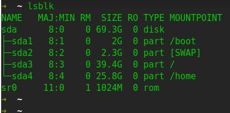

# 分区



# virtualbox
[安装](https://www.virtualbox.org/wiki/Linux_Downloads)

[manual](https://www.virtualbox.org/manual/)

[download](http://download.virtualbox.org/virtualbox/)

## 配置
* 存储：

控制器型号：AHCI  
虚拟硬盘端口：sata，固态，

```sh
下面是我在manjaro安装virtualbox的步骤，参考一下吧。
1. 终端之星sudo pacman -S virtualbox。根据实际内核版本选择对应的virtualbox-host-modules版本。
2. 运行yay -S virtualbox-ext-oracle 安装扩展包，即”全局设定”中的”扩展”功能。这样才能使用USB设备。
3. 使用USB外设:终端运行sudo gpasswd -a $USER vboxusers ，添加当前用户到vboxusers。这里需要将$USER替换为实际的用户名。（不替换$USER也可以将当前用户添加到vboxusers中）
4. 重新启动系统或执行sudo modprobe vboxdrv，之后就可以启动virtualbox了。
5. 安装增强功能。如果虚拟系统是windows，可以将VBoxGuestAdditions_6.1.4.iso到虚拟光驱，直接运行安装即可。如果虚拟系统是linux，安装前需要先安装gcc和linux-headers，然后将VBoxGuestAdditions_6.1.4.iso加载到虚拟光驱后，将其中的所有文件复制出来，执行sudo ./VBoxLinuxAdditions.run。增强包下载地址：http://download.virtualbox.org/virtualbox/6.1.4/VBoxGuestAdditions_6.1.4.iso。修改链接中的版本号下载相应版本。

sudo su -
apt-get install build-essential linux-headers-`uname -r` console-setup dkms
cd /media/{username}/VBox_GAs_5.2.30
./VBoxLinuxAdditions.run

rcvboxadd setup

```

## 迁移
* 导入导出
* [UUID](https://www.jianshu.com/p/db11c684ad34)  

https://www.cnblogs.com/coodream2009/p/8578216.html
## 文件共享
[](https://rqsir.github.io/2019/05/23/VirtualBox-%E7%BD%91%E7%BB%9C%E6%A8%A1%E5%BC%8F%E6%80%BB%E7%BB%93/)
- [参考](http://www.cnblogs.com/xing901022/p/5774677.html)
- `sudo usermod -a -G vboxsf pmz`
- `sudo mount -t vboxsf e_drive /home/pmz/e`   
注意e_drive是共享文件名称，不是具体win系统文件路径

- 如果没有自动挂载，可以在 /etc/fstab 添加一行配置  
`e_drive   /home/pmz/e   vboxsf   defaults  0   0`  
“设备文件 挂载目录 格式类型 权限选项 自检 优先级”

https://www.jianshu.com/p/da50140327da

## [网络配置](https://rqsir.github.io/2019/05/23/VirtualBox-%E7%BD%91%E7%BB%9C%E6%A8%A1%E5%BC%8F%E6%80%BB%E7%BB%93/)
* https://rqsir.github.io/2019/05/23/VirtualBox-%E7%BD%91%E7%BB%9C%E6%A8%A1%E5%BC%8F%E6%80%BB%E7%BB%93/

* http://www.albertzhou.net/blog/2019/02/virtualbox.html  
https://blog.csdn.net/GD_Hacker/article/details/80961159
https://blog.csdn.net/xybelieve1990/article/details/86736961
* 双网卡 
   1. nat
   2. host-only
* /etc/sysconfig/network-scripts/ifcfg-ens3
```sh
BOOTPROTO="static"
IPADDR="192.168.56.101"
NETMASK="255.255.255.0"
GATEWAY="192.168.56.1"
onboot=yes
``` 
* 开启 `ifup eth0`
* 重启网络 `service network restart`

### 显示

https://blog.csdn.net/u010168781/article/details/100978737


# vmware

* 桥接模式：相当于在物理主机与虚拟机网卡之间架设了一座桥梁，从而可以通过物理主机的网卡访问外网。

### NAT模式：让VM虚拟机的网络服务发挥路由器的作用，使得通过虚拟机软件模拟的主机可以通过物理主机访问外网，在真机中NAT虚拟机网卡对应的物理网卡是VMnet8。

* vmnet8 配置 vmware bridge protocol（使虚拟机能访问物理机）
固定ip 设置成 10.10.2.2（网关） ，关闭ipv6

* 虚拟机 nat 子网ip 设置成 10.10.2.0 子网掩码 255.255.255.0 网关 10.10.2.2 可设置端口转发，方便局域网内其他机器访问虚拟机

* 虚拟机 静态ip 10.10.2.xxx 网关设置成10.10.2.2 子网掩码 255.255.255.0 dns 设置成114

* 仅主机模式：仅让虚拟机内的主机与物理主机通信，不能访问外网，在真机中仅主机模式模拟网卡对应的物理网卡是VMnet1。

* https://www.jianshu.com/p/5b8da7a1ad63

### 虚拟机克隆 https://www.cnblogs.com/Lynette/p/9470800.html

* full clone  
   * 点击Ｎetwork Adapter，选择 nat， 然后点击右边的advanced,点击generate，使新的虚拟机生成新的MAC地址
   * 当我们使用 VMware 克隆 linux 主机时会发生克隆主机和原主机网卡 UUID 重复的问题，这样会对网络通信产生影响。
只要保证每台主机的 UUID 独一无二即可，即为新的主机绑定新的 UUID。
```sh
uuidgen
UUID=46269697-0bd5-4088-af92-337325daea9e
systemctl restart network
网卡 UUID值
nmcli connection show
nmcli device show ens33
```
   * vim /etc/sysconfig/network-scripts/ifcfg-eno33 ，设置新的ip
   * hostnamectl set-hostname node1
   * service network restart


00:0C:29:A3:D2:8F

00:0C:29:A3:D2:8F

00:50:56:24:75:BF

子网ip 10.10.2.0 子网掩码255.255.255.0 网关 10.10.2.2
适配器 10.10.2.1 选择nat

## vboxdrv服务没有正常运行

sc.exe query vboxdrv

sc start vboxdrv

如果启动失败，可以尝试重新安装vboxdrv。  
找到安装目录下的vboxdrv文件夹，VirtualBox\drivers\vboxdrv, 右击VBoxDrv.inf，选安装，然后重启。


