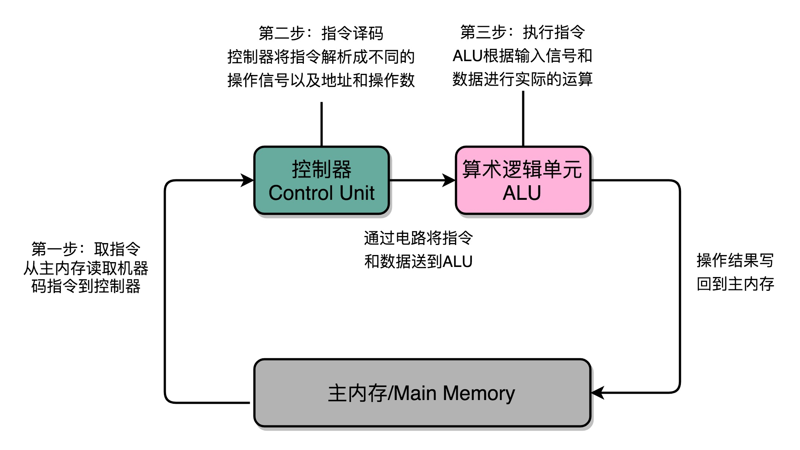

## 图灵机
* 可计算性理论
## 冯·诺依曼体系结构
* 运算器、控制器、存储器、输入设备和输出设备

## cpu
* 算术逻辑单元（Arithmetic Logic Unit，ALU）和处理器寄存器（Processor Register）的处理器单元（Processing Unit），用来完成各种算术和逻辑运算。
* 指令寄存器（Instruction Register）和程序计数器（Program Counter）的控制器单元（Control Unit/CU），用来控制程序的流程

## 思维导图

### 性能
性能指标：响应时间 + 吞吐率    
性能定义：1 / 响应时间  
计算机的计时单位：CPU 时钟,程序实际花费的 CPU 执行时间（CPU Time），就是 user time 加上 sys time。(sh: time)  
程序的 CPU 执行时间 = 指令数×CPI（Cycles Per Instruction，简称 CPI）×Clock Cycle Time 

### 性能提升
* 功耗 ~= 1/2 ×负载电容×电压的平方×开关频率×晶体管数量

想要计算得快，一方面，我们要在 CPU 里，同样的面积里面，多放一些晶体管，也就是增加密度，提升**制程**；另一方面，我们要让晶体管“打开”和“关闭”得更快一点，也就是提升主频。而这两者，都会增加功耗，带来**耗电和散热**的问题。

降低电压，功耗平方指数级降低

* 并行优化  
前提：符合 forkjoin 任务模型  
优化计算规律：阿姆达尔定律：优化后的执行时间 = 受优化影响的执行时间 / 加速倍数 + 不受影响的执行时间

* 加速大概率事件：向量与矩阵计算： cpu->gpu->tpu

* 通过流水线提高性能：指令分工

* 通过预测提高性能：分支和冒险、“局部性原理”

# 计算机指令和运算

## 指令集

* 高级语言->汇编语言->机器码
* 汇编代码（ASM，Assembly Language）和机器码之间是一一对应的
* 指令集：算术类、逻辑类、条件分支类、数据传输类（给变量赋值、在内存里读写数据）、无条件跳转（调用函数）

## 寄存器  
逻辑上，我们可以认为，CPU 其实就是由一堆寄存器组成的。而寄存器就是 CPU 内部，由多个触发器（Flip-Flop）或者锁存器（Latches）组成的简单电路。N 个触发器或者锁存器，就可以组成一个 N 位（Bit）的寄存器，能够保存 N 位的数据。比方说，我们用的 64 位 Intel 服务器，寄存器就是 64 位的。触发器和锁存器，其实就是两种不同原理的数字电路组成的逻辑门
### 分类与运行
* PC 寄存器：指令地址寄存器、指令寄存器、条件码寄存器、其他用来存储数据和内存地址的寄存器
* 一个程序执行的时候，CPU 会根据 PC 寄存器里的地址，从内存里面把需要执行的指令读取到指令寄存器里面执行，然后根据指令长度自增，开始顺序读取下一条指令。可以看到，一个程序的一条条指令，在内存里面是连续保存的，也会一条条顺序加载。

## cpu执行：指令封装与复用
* 内存栈：函数间调用，通过压栈帧（返回地址、参数列表）和出栈帧，在指令跳转的过程种，加入了一个“记忆”的功能，能够实现更加丰富和灵活的指令执行流程
* 优化：编译时内联（原因：CPU 需要执行的指令数变少了，根据地址跳转的过程不需要了，压栈和出栈的过程也不用了。缺点：程序占用空间变大），避免栈溢出（减少参数列表或者函数作用域里面的临时变量的占用内存，避免递归层数过深）

## 编译、链接和装载
* C 语言代码，可以通过编译器编译成汇编代码，然后汇编代码再通过汇编器变成 CPU 可以理解的机器码也叫：目标文件（Object File）。再通过链接器（Linker）把多个目标文件以及调用的各种函数库（os相关：系统调用，动态链接库）链接起来，我们才能得到一个可执行文件。
* 第一个部分由编译（Compile）、汇编（Assemble）以及链接（Link）三个阶段组成，生成了一个可执行文件。第二部分，我们通过装载器（Loader）把可执行文件装载（Load）到内存中。CPU 从内存中读取指令和数据，来开始真正执行程序。
* Linux 下，可执行文件和目标文件所使用的都是一种叫 ELF（Execuatable and Linkable File Format）的文件格式，中文名字叫可执行与可链接文件格式
* elf与静态链接机制   
ELF 文件格式把各种信息，分成一个一个的 Section 保存起来。ELF 有一个基本的文件头（File Header），用来表示这个文件的基本属性，比如是否是可执行文件，对应的 CPU、操作系统等等。代码段，数据段，重定位表（Relocation Table），符号表（Symbol Table）。符号表保留了我们所说的当前文件里面定义的函数名称和对应地址的地址簿。

* Windows 的可执行文件格式是一种叫作 PE（Portable Executable Format）的文件格式。
* 装载器：wine、wsl
* 高级语言：Java的类加载是由jvm完成，大致过程为装载-链接-初始化-运行，所以是jvm帮我们屏蔽了操作系统之间的差异。为了加快程序启动速度，一些类会延迟加载，所以jvm中有很多动态链接。

### 程序装载
* 要求
1. 可执行程序加载后占用的内存空间应该是连续的:程序计数器是顺序地一条一条指令执行下去
2. 我们需要同时加载很多个程序，并且不能让程序自己规定在内存中加载的位置（让程序不需要考虑实际的物理内存地址、大小和当前连续分配空间问题）。
* 解决方案：加入一个间接层
1. 内存页映射：虚拟内存地址（Virtual Memory Address 指令里用到的内存地址，对于任何一个程序来说，它看到的都是同样的内存地址）与物理内存地址（Physical Memory Address实际在内存硬件里面的空间地址）映射表。
2. 内存分页： getconf PAGE_SIZE（4096）
3. 内存交换与虚拟内存：分配映射表后可以延迟加载，当cpu发出内存缺页错误（Page Fault，还没有加载或者交换出去在硬盘上），os将对应的页，从存放在硬盘上的虚拟内存里读取出来，加载到物理内存里。

### 动态链接
* 编译出来的共享库文件的指令代码，是地址无关码（Position-Independent Code）。动态代码库内部的变量和函数调用，使用相对地址（Relative Address）。
* 动态链接的解决方案：
1. 程序链接表（Procedure Link Table）里面找要调用的函数。
2. 在动态链接对应的共享库，我们在共享库的 data section 里面，保存了一张全局偏移表（GOT，Global Offset Table）。虽然共享库的代码部分的物理内存是共享的，但是数据部分是各个动态链接它的应用程序里面各加载一份的。所有需要引用当前共享库外部的地址的指令，都会查询 GOT，来找到当前运行程序的虚拟内存里的对应位置。而 GOT 表里的数据，则是在我们加载一个个共享库的时候写进去的。不同的进程，调用同样的 lib.so，各自 GOT 里面指向最终加载的动态链接库里面的虚拟内存地址是不同的。
3. PLT是为了做延迟绑定，如果函数没有实际被调用到，就不需要更新GOT里面的数值。因为很多动态装载的函数库都是不会被实际调用到的。
* **不仅能够做到代码在开发阶段的复用，也能做到代码在运行阶段的复用。**

### 二进制编码
* ASCII 码里面，数字 9 不再像整数表示法里一样，用 0000 1001 来表示，而是用 0011 1001 来表示。字符串 15 也不是用 0000 1111 这 8 位来表示，而是变成两个字符 1 和 5 连续放在一起，也就是 0011 0001 和 0011 0101，需要用两个 8 位来表示。
* 字符集（Charset）和字符编码（Character Encoding）: Unicode，其实就是一个字符集，包含了 150 种语言的 14 万个不同的字符。而字符编码则是对于字符集里的这些字符，怎么一一用二进制表示出来的一个字典

### 门电路
* 继电器（Relay）：中继，其实就是不断地通过新的电源重新放大已经开始衰减的原有信号
* 反向器（Inverter）:反向器的电路，其实就是开关从默认关闭变成默认开启而已
* 门电路，叫作组合逻辑电路。与、或、非,异或（XOR）门
### 加法器(超前进位加法器)
* 通过一个异或门计算出个位，通过一个与门计算出是否进位，我们就通过电路算出了一个一位数的加法。于是，我们把两个门电路打包，给它取一个名字，就叫作半加器（Half Adder）。
* 我们用两个半加器和一个或门，就能组合成一个全加器。
* 8 位加法器可以由 8 个全加器串联而成
* 程序知道运算溢出的原因
* https://nieyong.github.io/wiki_cpu/CPU%E4%BD%93%E7%B3%BB%E6%9E%B6%E6%9E%84-RISC%E5%92%8CCISC.html
### 乘法器
* 是用更少更简单的电路，但是需要更长的门延迟和时钟周期；还是用更复杂的电路，但是更短的门延迟和时钟周期来计算一个复杂的指令，这之间的权衡，其实就是计算机体系结构中 RISC 和 CISC 的经典历史路线之争。

### 进制转换与表示
* 整数  
十进制转换为二进制: 除2取余，逆序排列  
二进制转换为十进制 : 按权相加法  
* 实数   
十进制转换为二进制：   
整数部分除 2 取余，逆序排列，小数部分乘 2 取整，顺序排列  
二进制转换为十进制： 按权相加法 

### 浮点数据的存储导致精度损失
* 先转成二进制，在转成IEEE754
* IEEE 754：浮点型分为符号位,指数位和有效位，x=(−1)S×(1.M)×2e，符号位 S：0是正数, 1是负数，指数位 e（指数位在这里兼具了需要表示正负的责任，它规定最大值/2 - 1表示指数0，单精度浮点数指数区域能够表示的最大数为2^8-1 = 255，那么255/2 - 1 = 127, 127代表指数0，128代表指数1, 126代表指数-1），有效位M（浮点数据的小数部分）

### 精度运算解决方案
* 转换成整型
* 使用Decimal函数
* 大数吃小数：[Kahan_summation_algorithm](https://en.wikipedia.org/wiki/Kahan_summation_algorithm)

# 处理器
## 指令+计算
### 指令周期（Instruction Cycle）
* Fetch（取得指令），也就是从 PC 寄存器里找到对应的指令地址，根据指令地址从内存里把具体的指令，加载到指令寄存器中，然后把 PC 寄存器自增，好在未来执行下一条指令。
* Decode（指令译码），也就是根据指令寄存器里面的指令，解析成要进行什么样的操作，是 R、I、J 中的哪一种指令，具体要操作哪些寄存器、数据或者内存地址。
* Execute（执行指令），也就是实际运行对应的 R、I、J 这些特定的指令，进行算术逻辑操作、数据传输或者直接的地址跳转。

* 指令译码器将输入的机器码，解析成不同的操作码和操作数，然后传输给 ALU 进行计算
* 对于一个指令周期来说，我们取出一条指令，然后执行它，至少需要两个 CPU 周期。从内存里面读取一条指令的最短时间，称为 CPU 周期，复杂的指令则需要更多的 CPU 周期.一个指令周期，包含多个 CPU 周期，而一个 CPU 周期包含多个时钟周期。
### 组合逻辑电路和时序逻辑电路（自动运行，存储，时序协调）
* ALU 这样的组合逻辑电路、用来存储数据的锁存器和 D 触发器电路、用来实现 PC 寄存器的计数器电路，以及用来解码和寻址的译码器电路。
* 逻辑1和0的本质，是电压：在高电压区域的一个范围，对应数字逻辑1；在低电压区的一个范围，代表数字逻辑0，也就是所谓的高低电平。
* 反馈电路（Feedback Circuit）：把电路的输出信号作为输入信号，再回到当前电路，反相器（Inverter），非门，能够产生时钟信号。通过“外频 + 倍频“的方式来实现高频率的时钟信号
* 寄存器：通过 D 型触发器来构造,一个 D 型触发器，只能控制 1 个比特的读写，但是如果我们同时拿出多个 D 型触发器并列在一起，并且把用同一个 CLK 信号控制作为所有 D 型触发器的开关，这就变成了一个 N 位的 D 型触发器，也就可以同时控制 N 位的读写。。（当两个开关都断开的时候，最终的输出结果，取决于之前动作的输出结果，这个也就是我们说的记忆功能）。电路的输出信号不单单取决于当前的输入信号，还要取决于输出信号之前的状态。最常见的这个电路就是我们的 D 触发器，它也是我们实际在 CPU 内实现存储功能的寄存器的实现方式。

* 每次自增之后，我们可以去对应的 D 型触发器里面取值，这也是我们下一条需要运行指令的地址。前面第 5 讲我们讲过，同一个程序的指令应该要顺序地存放在内存里面。这里就和前面对应上了，顺序地存放指令，就是为了让我们通过程序计数器就能定时地不断执行新指令。
### cpu 运行

* 通过流水线、分支预测等技术，来实现在一个周期里同时执行多个指令。
* 无条件跳转并不涉及到alu的计算，因此，可以直接设置PC寄存器中的值来实现跳转

## 面向流水线的指令设计
* 提高吞吐率（流水线深度+CPU主频同时增加）：在同一时间，同时执行 5 条不同指令的不同阶段，ARM 或者 Intel 的 CPU，流水线级数都已经到了 14 级。但是，每增加一级的流水线，就要多一级写入到流水线寄存器（Pipeline Register）的操作。虽然流水线寄存器非常快，比如只有 20 皮秒（ps，10−12 秒），但深度增加，占比增加。
* 数据冒险，结构冒险、控制冒险：解决方案：乱序执行、分支预测，分级不要太多（多线程不适合有依赖关系的逻辑运算）
### 结构冒险（本质上是一个硬件层面的资源竞争问题）
* 同一个时钟周期，两个不同指令访问同一个资源：现代 CPU 架构，借鉴了哈佛架构，在高速缓存层面拆分成指令缓存和数据缓存，它会从主内存把指令和数据加载到高速缓存中，这样后续的访问都是访问高速缓存。
### 数据冒险：三种不同的依赖关系
* 先写后读（数据依赖），先读后写（反依赖），写后再写（输出依赖）。除了读之后再进行读，你会发现，对于同一个寄存器或者内存地址的操作，都有明确强制的顺序要求。而这个顺序操作的要求，也为我们使用流水线带来了很大的挑战。
* 解决：在进行指令译码的时候，会拿到对应指令所需要访问的寄存器和内存地址。所以，在这个时候，我们能够判断出来，这个指令是否会触发数据冒险（实际的CPU硬件里面有专门的冒险检测电路。）。如果会触发数据冒险，我们就可以决定，让整个流水线停顿一个或者多个周期（插入一个 NOP 操作，也就是执行一个其实什么都不干的操作，又被叫作流水线冒泡（Pipeline Bubble））。该方案是以牺牲 CPU 性能为代价的。因为，实际上在最差的情况下，我们的流水线架构的 CPU，又会退化成单指令周期的 CPU 了。delay slot是MIPS对这个的具体实现和解决方案

### 操作数前推
* 通过 NOP 操作进行对齐：有些指令没有对应的流水线阶段，但是我们并不能跳过对应的阶段直接执行下一阶段。不然，如果我们先后执行一条 LOAD 指令和一条 ADD 指令，就会发生 LOAD 指令的 WB 阶段和 ADD 指令的 WB 阶段，在同一个时钟周期发生。这样，相当于触发了一个结构冒险事件，产生了资源竞争。各个指令不需要的阶段，并不会直接跳过，而是会运行一次 NOP 操作。通过插入一个 NOP 操作，我们可以使后一条指令的每一个 Stage，一定不和前一条指令的同 Stage 在一个时钟周期执行。
* 指令对齐和流水线冒泡导致的cpu空转

* 操作数前推（Operand Forwarding）或操作数旁路（Operand Bypassing）

在 CPU 的硬件里面，需要再单独拉一根信号传输的线路出来，使得 ALU 的计算结果，能够重新回到 ALU 的输入里来。这样的一条线路，就是我们的“旁路”。它越过（Bypass）了写入寄存器，再从寄存器读出的过程，也为我们节省了 2 个时钟周期。
* 操作数前推的解决方案不但可以单独使用，还可以和流水线冒泡一起使用

### 乱序执行
* 整个乱序执行技术，就好像在指令的执行阶段提供一个“线程池”。指令不再是顺序执行的，而是根据池里所拥有的资源，以及各个任务是否可以进行执行，进行动态调度。在执行完成之后，又重新把结果在一个队列里面，按照指令的分发顺序重新排序。即使内部是“乱序”的，但是在外部看起来，仍然是井井有条地顺序执行。

* 指令执行的先后顺序，不再和它们在程序中的顺序有关。我们只要保证不破坏数据依赖就好了。CPU 只要等到在指令结果的最终提交的阶段，再通过重排序的方式，确保指令“实际上”是顺序执行的。
* https://en.wikipedia.org/wiki/Tomasulo_algorithm
* 保障内存数据访问顺序的模型，叫作强内存模型（Strong Memory Model）
### 控制冒险（Control Harzard）:为了确保能取到正确的指令，而不得不进行等待延迟
* 在结构冒险和数据冒险中，所有的流水线停顿操作都要从指令执行阶段开始，但是条件、循环逻辑等要等 jmp 指令执行完成，去更新了 PC 寄存器之后，我们才能知道，是否执行下一条指令，还是跳转到另外一个内存地址，去取别的指令。
* 控制冒险策略，有缩短分支延迟，分支预测，动态分支预测
* 分支预测：交换内外循环的顺序，因为控制冒险导致性能差异。虽然执行的指令数是一样的，但是分支预测失败得多的程序，性能就要差上几倍。
### CPU的吞吐率超过1
* 超标量，也就是 Superscalar 这个方法。超标量可以让 CPU 不仅在指令执行阶段是并行的，在取指令和指令译码的时候，也是并行的。依赖于在硬件层面，能够检测到对应的指令的先后依赖关系，解决“冒险”问题。
* 超长指令字（VLIW）：通过在编译器层面，直接分析出指令的前后依赖关系。于是，硬件在代码编译之后，就可以直接拿到调换好先后顺序的指令。并且这些指令中，可以并行执行的部分，会打包在一起组成一个指令包。安腾处理器在取指令和指令译码的时候，拿到的不再是单个指令，而是这样一个指令包。并且在指令执行阶段，可以并行执行指令包里所有的指令。

### 线程级并行和指令集并行
* 超线程（Hyper-Threading）：在一个物理 CPU 核心内部，会有双份的 PC 寄存器、指令寄存器乃至条件码寄存器。这样，这个 CPU 核心就可以维护两条并行的指令的状态。超线程的目的，是在一个线程 A 的指令，在流水线里停顿的时候，让另外一个线程去执行指令。两个线程间没有指令依赖。适合：磁盘io和网络io比较多的情况下

* 单指令多数据流（SIMD）：单指令，一个寄存器一次性可以加载 4 个整数。比起循环分别读取 4 次对应的数据，时间就省下来了。MMX（Matrix Math eXtensions，矩阵数学扩展）、SSE、AVX，多媒体处理、机器学习算法等矩阵运算，在处理向量计算的情况下，同一个向量的不同维度之间的计算是相互独立的。可视为“数据并行”的加速方案

### 异常和中断
* 计算机会为每一种可能会发生的异常，分配一个异常代码（Exception Number）。有些教科书会把异常代码叫作中断向量（Interrupt Vector）。在捕捉异常的时候，由硬件 CPU 在进行相应的操作，而在处理异常层面，则是由作为软件的异常处理程序进行相应的操作。I/O 发出的信号的异常代码，是由操作系统来分配的，也就是由软件来设定的。而像加法溢出这样的异常代码，则是由 CPU 预先分配好的，也就是由硬件来分配的。这又是另一个软件和硬件共同组合来处理异常的过程。CPU 在拿到了异常码之后，会先把当前的程序执行的现场，保存到程序栈里面，然后根据异常码查询-中断向量表（Interrupt Vector Table），找到对应的异常处理程序，最后把后续指令执行的指挥权，交给这个异常处理程序。
* 异常的处理：上下文切换(寄存器->内核栈(用户态和内核态之间的切换)和程序栈)

### 复杂指令集（Complex Instruction Set Computing，简称 CISC）和精简指令集（Reduced Instruction Set Computing，简称 RISC）
* RISC 的通过减少 CPI 来提升性能，而 CISC 通过减少需要的指令数来提升性能。

RISC 的 CPU 里完成指令的电路变得简单了，于是也就腾出了更多的空间。这个空间，常常被拿来放通用寄存器。因为 RISC 完成同样的功能，执行的指令数量要比 CISC 多，所以，如果需要反复从内存里面读取指令或者数据到寄存器里来，那么很多时间就会花在访问内存上。于是，RISC 架构的 CPU 往往就有更多的通用寄存器。RISC 的 CPU 也可以把更多的晶体管，用来实现更好的分支预测等相关功能，进一步去提升 CPU 实际的执行效率。
* 微指令（Micro-Instructions/Micro-Ops）架构。在机器码层面保留了 CISC 风格的x86 架构的指令集,但是，通过指令译码器和 L0 缓存的组合，使得这些指令可以快速翻译成 RISC 风格的微指令，使得实际执行指令的流水线可以用 RISC 的架构来搭建。而微指令架构的引入，也让 CISC 和 RISC 的分界变得模糊了。

* ARM-Advanced RISC Machines: https://riscv.org/

### GPU
* 基于多边形建模的三维图形的渲染
顶点处理（Vertex Processing）:每一个顶点位置的转换，互相之间没有依赖，是可以并行独立计算的   
图元处理（Primitive Processing）:各个顶点连起来,变成多边形,其实转化后的顶点，仍然是在一个三维空间里，只是第三维的 Z 轴，是正对屏幕的“深度”。 针对这些多边形，需要做一个操作，叫剔除和裁剪（Cull and Clip），也就是把不在屏幕里面，或者一部分不在屏幕里面的内容给去掉，减少接下来流程的工作量。    
栅格化（Rasterization）: 转换成屏幕里面的一个个像素点。这个栅格化操作，每一个图元都可以并行独立地栅格化。  
片段处理（Fragment Processing）:计算每一个像素的颜色、透明度等信息，给像素点上色,可并行。  
像素操作（Pixel Operations）：把不同的多边形的像素点“混合（Blending）”到一起

* 统一着色器架构（Unified Shader Architecture）:因为指令集是一样的，顶点处理、图元处理、片段处理这些任务，都交给这些 Shader 去处理，让整个 GPU 尽可能地忙起来。
* 芯片瘦身：没有 CPU 这样的分支预测和乱序执行电路.之后，基于渲染管线里面顶点处理和片段处理就是天然可以并行的了。我们在 GPU 里面可以加上很多个核。

* SIMT（Single Instruction，Multiple Threads）：SIMT 呢，比 SIMD 更加灵活。在 SIMD 里面，CPU 一次性取出了固定长度的多个数据，放到寄存器里面，用一个指令去执行。而 SIMT，可以把多条数据，交给不同的线程去处理。相同的代码和相同的流程，可能执行不同的具体的指令。在取指令和指令译码的阶段，取出的指令可以给到后面多个不同的 ALU 并行进行运算。这样，我们的一个 GPU 的核里，就可以放下更多的 ALU，同时进行更多的并行运算了。
* 超线程：因为芯片瘦身，GPU 里的指令，可能会遇到和 CPU 类似的“流水线停顿”问题,要调度一个不同的任务过来，我们就需要针对这个任务，提供更多的执行上下文。一个 Core 里面的执行上下文的数量，需要比 ALU 多

* https://www.techpowerup.com/gpu-specs/geforce-rtx-2080.c3224  
2080 一共有 46 个 SM（Streaming Multiprocessor，流式处理器），这个 SM 相当于 GPU 里面的 GPU Core，所以你可以认为这是一个 46 核的 GPU，有 46 个取指令指令译码的渲染管线。每个 SM 里面有 64 个 Cuda Core。你可以认为，这里的 Cuda Core 就是我们上面说的 ALU 的数量或者 Pixel Shader 的数量，46x64 呢一共就有 2944 个 Shader。然后，还有 184 个 TMU，TMU 就是 Texture Mapping Unit，也就是用来做纹理映射的计算单元，它也可以认为是另一种类型的 Shader。  
[Introduction-to-GPUs](./assets\Introduction-to-GPUs.pdf)

2080 的主频是 1515MHz，如果自动超频（Boost）的话，可以到 1700MHz。而 NVidia 的显卡，根据硬件架构的设计，每个时钟周期可以执行两条指令。所以，能做的浮点数运算的能力，就是：（2944 + 184）× 1700 MHz × 2  = 10.06  TFLOPS

### 现场可编程门阵列（Field-Programmable Gate Array）
* LUT（Look-Up Table，查找表）电路: 其实就是一块存储空间，里面存储了“特定的输入信号下，对应输出 0 还是 1”,代替需要的硬连线的电路，有了可编程的逻辑门
* 逻辑簇（Logic Cluster）: 对于需要实现的时序逻辑电路，我们可以在 FPGA 里面直接放上 D 触发器，作为寄存器。组合了多个 LUT 和寄存器的设备，也被叫做 CLB（Configurable Logic Block，可配置逻辑块）。
* FPGA，常常被我们用来进行芯片的设计和验证工作，也可以直接拿来当成专用的芯片，替换掉 CPU 或者 GPU，以节约成本。
### ASIC（Application-Specific Integrated Circuit），也就是专用集成电路
* 研发成本高，但制造，能耗成本低
* 用特制的硬件，最大化特定任务的运行效率
### TPU
* 做各种深度学习的推断而设计出来的，TPU 并不需要太灵活的可编程能力，只要能够迭代完成常见的深度学习推断过程中一层的计算过程就好了。所以，TPU 的硬件构造里面，把矩阵乘法、累加器和激活函数都做成了对应的专门的电路。
* 了满足深度学习推断功能的响应时间短的需求，TPU 设置了很大的使用 SRAM 的 Unified Buffer（UB），就好像一个 CPU 里面的寄存器一样，能够快速响应对于这些数据的反复读取。
* 为了让 TPU 尽可能快地部署在数据中心里面，TPU 采用了现有的 PCI-E 接口，可以和 GPU 一样直接插在主板上，并且采用了作为一个没有取指令功能的协处理器
* 因为机器学习的推断功能，通常做了数值的归一化，所以对于矩阵乘法的计算精度要求有限，整个矩阵乘法的计算模块采用了 8 Bits 来表示浮点数，而不是像 Intel CPU 里那样用上了 32 Bits（32 位浮点数的精度，差不多可以到 1/1600 万）。
### 虚拟机
* 解释型虚拟机：用应用程序解释需要模拟的计算机系统的程序格式和指令。宿主机（Host）-模拟器（Emulator）-客户机（Guest VM）
* 这种解释执行方式的最大的优势就是，模拟的系统可以跨硬件。eg:android Emulator,jvm.
* 缺点：做不到精确的“模拟”硬件。性能差。 JIT 这样的“编译优化”的办法，通过收集程序运行中反复执行的中间代码，直接编译成机器指令来执行
* 虚拟机监视器，英文叫 VMM（Virtual Machine Manager）或者 Hypervisor。Type-1型：实际的指令不需要再通过宿主机的操作系统，而可以直接通过虚拟机监视器访问硬件，KVM、XEN 还是微软自家的 Hyper-V，其实都是系统级的程序，嵌入在操作系统内核里面。需要包含能够直接操作硬件的驱动程序。所以 Type-1 的虚拟机监视器更大一些，同时兼容性也不能像 Type-2 型那么好。
* Docker 并没有再单独运行一个客户机的操作系统，而是直接运行在宿主机操作系统的内核之上只能算是一种资源隔离的技术而已。

# 存储器
## 总览
* SRAM（Static Random-Access Memory，静态随机存取存储器）：每个 CPU 核心都有一块属于自己的 L1 高速缓存，通常分成指令缓存和数据缓存，分开存放 CPU 使用的指令和数据。L1 的 Cache 往往就嵌在 CPU 核心的内部。L2 的 Cache 同样是每个 CPU 核心都有的，不过它往往不在 CPU 核心的内部。所以，L2 Cache 的访问速度会比 L1 稍微慢一些。而 L3 Cache，则通常是多个 CPU 核心共用的，尺寸会更大一些，访问速度自然也就更慢一些。
* DRAM（Dynamic Random Access Memory，动态随机存取存储器）芯片：因为 DRAM 需要靠不断地“刷新”，才能保持数据被存储起来。DRAM 的一个比特，只需要一个晶体管和一个电容就能存储。所以，DRAM 在同样的物理空间下，能够存储的数据也就更多，也就是存储的“密度”更大。因为数据是存储在电容里的，电容会不断漏电，所以需要定时刷新充电，才能保持数据不丢失。内存里的数据断电后也会丢失的原因。DRAM 的数据访问电路和刷新电路都比 SRAM 更复杂，所以访问延时也就更长。
* SSD（Solid-state drive 或 Solid-state disk，固态硬盘）：
* HDD（Hard Disk Drive，硬盘）
* 各个存储器只和相邻的一层存储器打交道，并且随着一层层向下，存储器的容量逐层增大，访问速度逐层变慢，而单位存储成本也逐层下降。性能差异和价格差异至少在一个数量级

[Latency Numbers Every Programmer Should Know](https://colin-scott.github.io/personal_website/research/interactive_latency.html)
## 缓存优化：局部性原理+读多写少
* 硬盘容量是内存的 16 倍乃至 128 倍，但是它们的访问速度却不到内存的 1/1000。

* 局部性原理（Principle of Locality）包括时间局部性（temporal locality）和空间局部性（spatial locality）这两种策略+LRU（Least Recently Used）缓存淘汰算法+缓存命中率。可以用最低的成本提供实际所需要的数据存储、管理和访问的需求。
* **估算 + 规划**：1s=1000ms=1000*1000us=1000*1000*1000ns 访问一次内存需要100ns, 那么1秒可以访问1s/100ns=10,000,000次。在实际的应用程序中，查看一个商品的数据可能意味着不止一次的随机内存或者随机磁盘的访问。对应的数据存储空间也不止要考虑数据，还需要考虑维护数据结构的空间，而缓存的命中率和访问请求也要考虑均值和峰值的问题。硬件规划：需求评估,访问的数据量以及访问的数据分布，然后根据这些数据的估算，来组合不同的存储器，能用尽可能低的成本支撑所需要的服务器压力。而当你用上了数据访问的局部性原理，组合起了多种存储器，你也就理解了怎么基于存储器层次结构，来进行硬件规划了。

## 高速缓存-读
* 一次内存的访问，大约需要 120 个 CPU Cycle，这也意味着，CPU 和内存的访问速度已经有了 120 倍的差距。按照摩尔定律，CPU 的访问速度每 18 个月便会翻一番，相当于每年增长 60%。内存的访问速度虽然也在不断增长，却远没有这么快，每年只增长 7% 左右。随着时间变迁，CPU 和内存之间的性能差距越来越大
* 现代 CPU 中大量的空间已经被 SRAM 占据，CPU 从内存中读取数据到 CPU Cache 的过程中，是一小块一小块（Cache Line（缓存块）64 字节）来读取数据的，CPU Cache 的命中率通常能达到 95% 以上。
* 直接映射 Cache（Direct Mapped Cache）：CPU 要访问的内存数据，存储在 Cache 的哪个位置？Cache 采用 mod 的方式，把内存块映射到对应的 CPU Cache 中。实际上：把缓存块的数量设置成 2 的 N 次方，这样在计算取模的时候，可以直接取Block 地址的低 N 位，也就是二进制里面的后几位，就能得到对应的 Cache Line 地址（mod -> 位运算）。将内存中数据加载进cache中时，是一个block一个block的读写。CPU从cache中读取数据时，是根据偏移量读取block中的一个字（Word）。总结一下，一个内存的访问地址，最终包括高位代表的组标记、低位代表的索引，以及在对应的 Data Block 中定位对应字的位置偏移量。

* 而内存地址对应到 Cache 里的数据结构，则多了一个有效位和对应的数据，由“索引 + 有效位  + 组标记 + 数据”组成。如果内存中的数据已经在 CPU Cache 里了，那一个内存地址的访问，就会经历这样 4 个步骤：
1. 根据内存地址的低位，计算在 Cache 中的索引；
2. 判断有效位，确认 Cache 中的数据是有效的；
3. 对比内存访问地址的高位，和 Cache 中的组标记，确认 Cache 中的数据就是我们要访问的内存数据，从 Cache Line 中读取到对应的数据块（Data Block）；
4. 根据内存地址的 Offset 位，从 Data Block 中，读取希望读取到的字。

如果在 2、3 这两个步骤中，CPU 发现，Cache 中的数据并不是要访问的内存地址的数据，那 CPU 就会访问内存，并把对应的 Block Data 更新到 Cache Line 中，同时更新对应的有效位和组标记的数据。CPU Cache 带来的毫秒乃至微秒级别的性能差异，又能带来巨大的商业利益.

## 高速缓存-写
* 在 CPU Cache 里，对于数据的写入，我们也有写直达和写回这两种解决方案。在写回这个策略里，如果我们大量的操作，都能够命中缓存。那么大部分时间里，我们都不需要读写主内存，只更新缓存,只有在需要把缓存里面的脏数据交换出去的时候，才把数据同步到主内存里.

* volatile 保障我们对于数据的读写都会到达主内存。否则，如果内存中的这个变量被别的因素（其他线程、中断函数、信号处理函数、DMA控制器、其他硬件设备）所改变了，就产生数据不一致的问题。另外，寄存器访问指令的速度要比内存访问指令的速度快，这里说的内存也包括缓存，也就是说内存访问指令实际上也有可能访问的是缓存里的数据，但即便如此，还是不如访问寄存器快的。缓存对于编译器也是透明的，编译器使用内存读写指令时只会认为是在读写内存，内存和缓存间的数据同步由CPU保证。
* https://developer.ibm.com/languages/java/

## MESI协议-缓存一致性
* 总线嗅探（Bus Snooping）机制:把所有的读写请求都通过总线（Bus）广播给所有的 CPU 核心，然后让各个核心去“嗅探”这些请求，再根据本地的情况进行响应，能够实现事务的串行化。

* MESI 协议：基于写失效的缓存一致性协议，是支持回写（write-back）缓存的最常用协议。整个 MESI 的状态变更，则是根据来自自己 CPU 核心的请求，以及来自其他 CPU 核心通过总线传输过来的操作信号和地址信息，进行状态流转的一个有限状态机。

* [wiki](https://zh.wikipedia.org/wiki/MESI%E5%8D%8F%E8%AE%AE)
* [极客时间](https://time.geekbang.org/column/article/109874)

## 虚拟内存和内存保护
* 页号是20位，另外12位是偏移地址。 每页大小是4KB，4K=2^12B，所以要在4KB的页面里面进行寻址，偏移量是12位。 要表示4GB的内存，4GB = 2^32 = 2^20 * 2^12，所以需要2^20页，所以页号是20位。