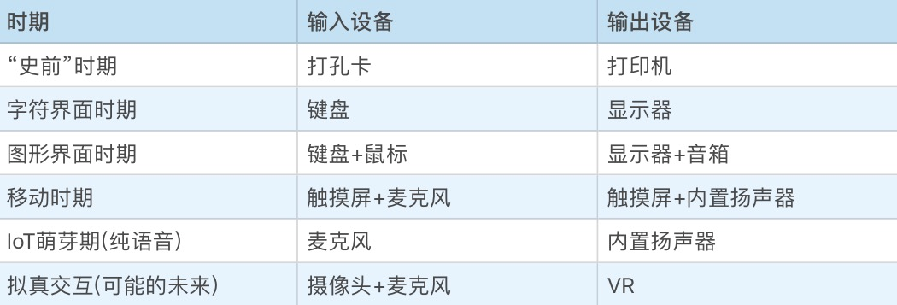

# 架构师

从根本目标来说，软件架构师要对软件工程的执行结果负责，这包括：按时按质进行软件的迭代和发布、敏捷地响应需求变更、防范软件质量风险（避免发生软件质量事故）、降低迭代维护成本。

架构也关乎用户需求，作为架构师，我们不只是要知道当前的用户需求是什么，我们还要预测需求未来可能的变化，预判什么会发生，而什么一定不会发生。预测什么不会发生最为重要，只有做到这一点，才能真正防止架构的过度设计，把简单的事情复杂化。

架构思维：分解系统的思考方式（方法论）

# 基础架构

设备：中央处理器 + 存储 + 一系列的输入输出设备 **计算+io**

* 可编程性：  
cpu指令集分类：计算类，io从存储或者输入输出设备读写类，指令跳转类

编程语言 + 编译器 

* 开放设计的外部设备支持：端口、设备驱动

操作系统：进程管理+内存管理+IO管理+硬件封装

## 应用架构

### 跨平台

服务端：浏览器

客户端：

# 解剖架构

**需求分析**：核心价值、定位，边界扩展(需求的稳定点和变化点)  
规格：链接需求的抽象，约束条件是与其他组件连接在一起的价值

冯*诺依曼体系：**解决一切可以用‘计算’来解决的问题**-> 甚至智能，需求的稳定点是计算能力，需求的变化点，一是用户“计算”需求的多样性，二是用户交互方式的多样性。

* 主板rom里的bios包含：

存储设备的驱动程序，用以识别常规的外置存储设备，比如硬盘、光驱、U 盘。   

基础外部设备的驱动程序，比如键盘、鼠标、显示器（显卡）。 

设备和启动配置的基础管理能力。在外置存储上执行程序的能力（中央处理器只支持在内存上执行程序，当然它也为在外置存储执行程序提供了一些支持，比如内存页缺失的中断处理）。  

将执行权转移到外置存储（第一次安装操作系统的时候可能是光驱甚至是网络存储，平常通常是硬盘）上的操作系统启动程序。这样，操作系统就开始干活了。

* 需求变化扩展  

“计算”需求的多样性只需要通过调整计算机主板上的 BIOS 程序，乃至外置存储中的操作系统启动程序就可以实现，而不必去修改中央处理器本身。

用户交互方式的多样性，则通过定义外部设备与中央处理器的数据交换协议实现。

* 描述需求需要有几个典型的要素  

1、用户，面向什么人群；  
2、他们有什么要解决的问题；  
3、我解决这个问题的核心系统。  
只有满足这几个要素的需求才能进一步讨论变化点和稳定点。最小机器人可能符合上面的3，但是用户人群和要解决的问题没有描述，也就无法进一步去思考到底哪些因素是稳定的，哪些是易变的。

# 编程范式进化
* 过程式： 自定义数据结构和函数-复用和简化
* 函数式： 本质上是过程式编程的一种约束，它最核心的主张就是变量不可变，函数尽可能没有副作用
* 面向对象：   

清晰的使用界面，某种类型的对象有哪些方法一目了然，而不像过程式编程，数据结构和过程的关系是非常松散的。

是信息的封装。面向对象不主张绕过对象的使用接口侵入到对象的内部实现细节。因为这样做破坏了信息的封装，降低了类的可复用性。

多态：由于对象和对象方法的强关联，我们可以引入接口来抽象不同对象相同的行为。

继承：复用两种方式：组合和继承

* 面向连接：就是朴素的组合思想，例如：消息传递机制：go-csp

# 工程能力的进化
* 开发：包，版本，doc，test
* 部署: 可执行文件，虚拟机字节码（依赖多余的执行器），直接解释执行（并不绝对）

# os
操作系统内核有六大子系统：存储管理、输入设备管理、输出设备管理、进程管理、网络管理、安全管理。

计算机加电启动后，中央处理器（CPU）会从一个固定的存储地址加载指令序列执行。通常，这个固定的存储地址指向计算机主板的 ROM 上的一段启动程序（BIOS）:

### BIOS

存储设备的驱动程序，用以识别常规的外置存储设备,比如硬盘、光驱、U 盘  
基础外部设备的驱动程序，比如键盘、鼠标、显示器。
设备和启动配置的基础管理能力。  
支持执行外置存储中引导区的机器代码程序。  
跳转到外置存储引导区的固定地址，把执行权交给该地址上的引导程序。

## 操作系统的核心价值：
* 实现软件治理，让多个软件和谐共处；
* 提供基础的编程接口，降低软件开发难度。

### 流量入口和流量变现
* 预装软件或广告
* 收税模式：账号，支付，应用市场（解决了客户价值和商业价值）

## 软件运行机制及内存管理

CPU 可以直接访问的存储资源非常少，只有：寄存器、内存（RAM）、主板上的 ROM。

ROM 非易失和只读的特点，决定了它非常适合存储计算机的启动程序（BIOS）。

CPU 的实模式和保护模式。这两个模式 CPU 对内存的操作方式完全不同。在实模式下，CPU 直接通过物理地址访问内存。在保护模式下，CPU 通过一个地址映射表把虚拟的内存地址转为物理的内存地址，然后再去读取数据。

虚拟地址并不是全局的，而是每个进程有一个自己独立的虚拟地址空间，fork操作需要拷贝这个表。通过把虚拟内存地址分页，引入缺页中断（对应的物理内存地址不存在或不空闲，需要中断申请或者swap分区），缺页中断很像是 CPU 留给操作系统的回调函数，通过它对变化点实现了很好的开放性设计。

## 操作系统内核与编程接口

### 系统调用
中断的设计初衷是 CPU 响应硬件设备事件的一个机制。当某个输入输出设备发生了一件需要 CPU 来处理的事情，它就会触发一个中断（总是会定期检查是否有中断，中断有优先级）；但是 CPU 也提供了指令允许软件触发一个中断，我们把它叫软中断。

cpu指令执行权限（Ring 0-3 四个等级）：操作系统内核通常运行在 Ring 0（内核态），而常规的软件进程运行在 Ring 3（用户态）（当然近年来虚拟化机制流行，为了更好地提升虚拟化的效率，Intel CPU 又引入了 Ring -1 级别的指令，这些指令只允许虚拟机所在的宿主操作系统才能调用）。

操作系统内核和所有进程都在同一个地址空间，也就是，操作系统内核，不只为所有进程所共享，而且在所有进程中拥有相同的地址。

**不能直接调用**：虚拟内存中的内存页保护机制。内存页可以设置 “可读、可写、可执行” 三个标记位。操作系统内核虽然和用户进程同属一个地址空间，但是被设置为“不可读、不可写、不可执行”
### 操作系统基础库-动态库

本质上是实现了一个语言无关的代码复用机制。它是二进制级别的复用，而不是代码级别的。这很有用，大大降低了编程语言标准库的工作量（libc.so）。原理：    

* 浮动地址。动态库本质上是在一个进程地址空间中动态加载程序片段，这个程序片段的地址显然在编译阶段是没法确定的，需要在加载动态库的过程把浮动地址固定下来。
* 导出函数表。

## 外存管理与文件系统
分区：本质上只是把一个存储设备模拟成多个存储设备来使用而已。

分区->格式化->挂载

### direct io
* 禁止掉文件系统的io缓存。
* 直接裸写磁盘分区。不需要分区格式化
## [输入和输出设备：交互的演进](https://time.geekbang.org/column/article/95660)

交互方式不管怎么变化，输入的两大能力：输入文本和触发命令，这一点是不变的。事实上输入意图的理解越来越难了，因为交互在朝着自然（Nature）和智能（Intelligence）的方向发展。
输出：
* 显示器：os提供了：窗口系统，绘制子系统，控件

## 多任务：进程、线程与协程
分时系统：
执行体：可被 CPU 赋予执行权的对象，它至少包含下一个执行位置（获得执行权后会从这里开始执行）以及其他的运行状态。
