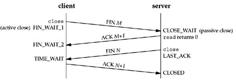

* [TCP 协议简介](http://www.ruanyifeng.com/blog/2017/06/tcp-protocol.html)
* [TCP协议的三次握手和四次分手](https://github.com/jawil/blog/issues/14)

* MSL时间  
MSL就是maximum segment lifetime(最大分节生命期），这是一个IP数据包能在互联网上生存的最长时间，超过这个时间IP数据包将在网络中消失 。MSL在RFC 1122上建议是2分钟，而源自berkeley的TCP实现传统上使用30秒。
* TIME_WAIT状态维持时间  
TIME_WAIT状态维持时间是两个MSL时间长度，也就是在1-4分钟。Windows操作系统就是4分钟。
## 长连接
* HTTP长连接的数据传输完成识别  
使用长连接之后，客户端、服务端怎么知道本次传输结束呢？两部分：1是判断传输数据是否达到了Content-Length指示的大小；2动态生成的文件没有Content-Length，它是分块传输（chunked），这时候就要根据chunked编码来判断，chunked编码的数据在最后有一个空chunked块，表明本次传输数据结束。

* HTTP/1.1起，默认使用长连接，用以保持连接特性。使用长连接的HTTP协议，会在响应头有加入这行代码：
Connection:keep-alive  
Keep-Alive: timeout=20

### Socket 编程
* 概述  
socket通信是大家耳熟能详的一种进程间通信方式(IPC)，它是一种全双工的通信方式，不同于pipe这种单工方式.这篇文章将深入浅出的讲解一下什么是socket。
我们常说的socket通信有以下二种,主要会说一下Unix domain socket

* Internet domain socket  
该socket可以用于不同主机间的通信，就像聊QQ一样只要知道了对方的QQ号就可以聊天了。socket只要知道了对方的ip地址和端口就可以通信了所以这种socket通信是基于网络协议栈的。

* Unix domain socket  
该socket用于一台主机的进程间通信，不需要基于网络协议，主要是基于文件系统的。与Internet domain socket类似，需要知道是基于哪一个文件（相同的文件路径）来通信的
unix domain socket有2种工作模式一种是SOCK_STREAM，类似于TCP，可靠的字节流。另一种是SOCK_DGRAM，类似于UDP，不可靠的字节流。

* 工作模型  
socket通信有一个服务端，一个客服端
服务端：创建socket—绑定文件（端口）—监听—接受客户端连接—接收/发送数据—…—关闭
客户端：创建socket—绑定文件（端口）—连接—发送/接收数据—…—关闭
#### 参考:  

* [Unix Socket by Hly_Coder](http://www.jianshu.com/p/d4bb6d4f8e4c) 
