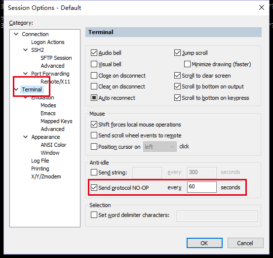
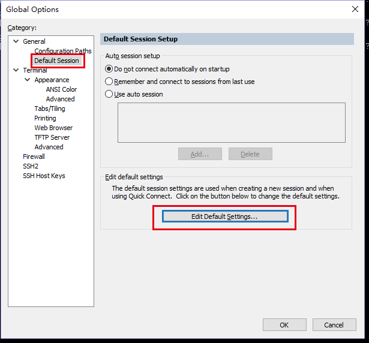
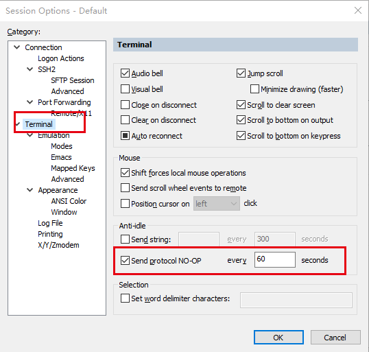

## 解决方案，亲测有效
 使用SecureCRT远程ssh 到服务器时，一段时间不用的话会自动断开，必须重新连接，十分恶心(不知道官方默认配置，为什么不设置好) 

1.session 设置： Options-－>Session Options－－>点击 Terminal，如图勾线  

2. 如果要所有会话都起作用，则点击Options －>Global Options－－>General－－>Default Session ,点击 Edit Default Settings

3. 此时会出现 与 session 设置 相似的界面，如图，重复第一步操作即可
