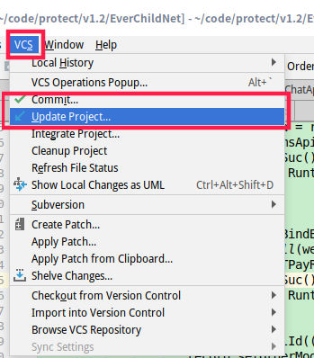

## 安装见../linux/deepin.md

```sh
usage: svn <subcommand> [options] [args]                              
Subversion command-line client.                                       
Type 'svn help <subcommand>' for help on a specific subcommand.       
Type 'svn --version' to see the program version and RA modules        
  or 'svn --version --quiet' to see just the version number.          
                                                                      
Most subcommands take file and/or directory arguments, recursing      
on the directories.  If no arguments are supplied to such a           
command, it recurses on the current directory (inclusive) by default. 
                                                                      
Available subcommands:                                                
   add                                                                
   auth                                                               
   blame (praise, annotate, ann)                                      
   cat                                                                
   changelist (cl)                                                    
   checkout (co)                                                      
   cleanup                                                            
   commit (ci)                                                        
   copy (cp)                                                          
   delete (del, remove, rm)                                           
   diff (di)                                                          
   export                                                             
   help (?, h)                                                        
   import                                                             
   info                                                               
   list (ls)                                                          
   lock                                                               
   log                                                                
   merge                                                              
   mergeinfo                                                          
   mkdir                                                              
   move (mv, rename, ren)                                             
   patch                                                              
   propdel (pdel, pd)                                                 
   propedit (pedit, pe)                                               
   propget (pget, pg)                                                 
   proplist (plist, pl)                                               
   propset (pset, ps)                                                 
   relocate                                                           
   resolve                                                            
   resolved                                                           
   revert                                                             
   status (stat, st)                                                  
   switch (sw)                                                        
   unlock                                                             
   update (up)                                                        
   upgrade                                                            
                                                                      
Subversion is a tool for version control.                             
For additional information, see http://subversion.apache.org/         
```

svn mkdir http://192.168.200.225/svn/product/Project/sun_daemon_V1.0.0/01_Development/05_Code/01_Source_Code/trunk/ShanDong/ -m "create repo dir" --parents

2：上传项目到SVN服务器上

svn import project_dir http://192.168.1.2/svn/remote_dir -m "必填, 不填此命令执行不会成功."


svn import pom.xml http://192.168.200.225/svn/product/Project/all_antifraud_V1.0.0/01_Development/05_Code/01_Source_Code/backend/pom.xml -m "parent pom"

上传文件，目标文件名也需要
注: 服务器上remote_dir若不存在, 会自动创建;

注: 只会上传project_dir目录下的文件到remote_dir的目录下

注: import之后, project_dir并没有自动转化为工作目录, 需要重新checkout(后面会用到)

svn mkdir  http://192.168.200.225/svn/product/Project/sun_daemon_V1.0.0/01_Development/05_Code/01_Source_Code/trunk/ShanDong/EverChildNet -m "mv"

svn mv  http://192.168.200.225/svn/product/Project/sun_daemon_V1.0.0/01_Development/05_Code/01_Source_Code/trunk/ShanDong/src http://192.168.200.225/svn/product/Project/sun_daemon_V1.0.0/01_Development/05_Code/01_Source_Code/trunk/ShanDong/EverChildNet -m "mv"

## svn checkout
* svn co url

## IntelliJ IDEA 中 svn 修改服务器地址的方法 



## smartsvn

* [解决冲突](https://www.jianshu.com/p/0d056c41d304)