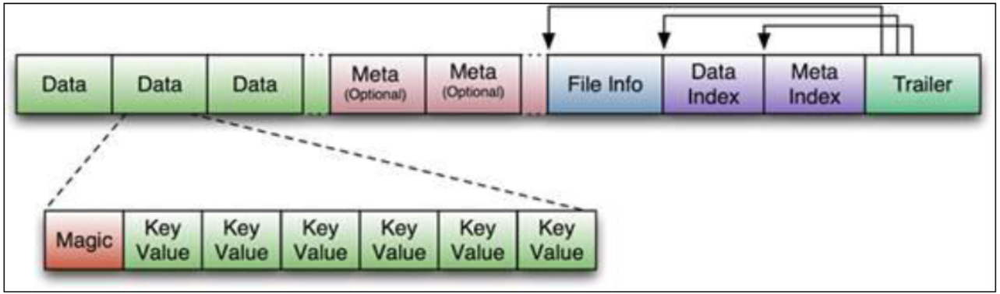
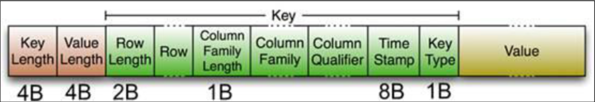

# 介绍

http://hbase.apache.org/book.html
https://www.cnblogs.com/qingyunzong/category/1187868.html

### java 编写

强读写一致  
自动的故障转移  
Thrift/REST API，Java API  
块缓存，布隆过滤器，可以高效的列查询优化  
操作管理，Hbase 提供了内置的 web 界面来操作，还可以监控 JMX 指标

### HBase 的优势

海量数据存储  
快速随机访问  
大量写操作的应用

### 架构

每个 region 由以下信息标识：< 表名,startRowkey,创建时间>
由目录表(-ROOT-和.META.)记录该 region 的 endRowkey

每一个 region 由一个或多个 store 组成，至少是一个 store，hbase 会把一起访问的数据放在一个 store 里面，即为每个 ColumnFamily 建一个 store，如果有几个 ColumnFamily，也就有几个 Store。一个 Store 由一个 memStore 和 0 或者多个 StoreFile 组成。 HBase 以 store 的大小来判断是否需要切分 region

memStore 是放在内存里的。保存修改的数据即 keyValues。当 memStore 的大小达到一个阀值（默认 128MB）时，memStore 会被 flush 到文 件，即生成一个快照。目前 hbase 会有一个线程来负责 memStore 的 flush 操作。客户端检索数据时，先在 memstore 找，找不到再找 storefile。

memStore 内存中的数据写到文件后就是 StoreFile，StoreFile 底层是以 HFile 的格式保存。

HBase 中 KeyValue 数据的存储格式，HFile 是 Hadoop 的 二进制格式文件，实际上 StoreFile 就是对 HFile 做了轻量级包装，即 StoreFile 底层就是 HFile

HLog(WAL log)：WAL 意为 write ahead log，用来做灾难恢复使用，HLog 记录数据的所有变更，一旦 region server 宕机，就可以从 log 中进行恢复。每个 Region Server 维护一个 Hlog,这样不同 region(来自不同 table) 的日志会混在一起，这样做的目的是不断追加单个文件相对于同时写多个文件而言，可以减少磁盘寻址次数，因此可以提高对 table 的写性能。带来的麻烦是，如果一台 region server 下线，为了恢复其上的 region，需要将 region server 上的 log 进行拆分，然后分发到其它 region server 上进行恢复。
HLog 文件就是一个普通的 Hadoop Sequence File， Sequence File 的 key 是 HLogKey 对象，其中记录了写入数据的归属信息，除了 table 和 region 名字外，还同时包括 sequence number 和 timestamp，timestamp 是写入时间，sequence number 的起始值为 0，或者是最近一次存入文件系统中的 sequence number。 Sequence File 的 value 是 HBase 的 KeyValue 对象，即对应 HFile 中的 KeyValue。

### 数据模型

单元格（Cell）：表存储数据的单元。由{行健，列（列族:标签），时间戳}唯一确定，其中的数据是没有类型的，以二进制的形式存储。

### 物理存储

1、Table 中的所有行都按照 RowKsey 的字典序排列。

2、Table 在行的方向上分割为多个 HRegion。

3、HRegion 按大小分割的(默认 10G)，每个表一开始只有一个 HRegion，随着数据不断插入表，HRegion 不断增大，当增大到一个阀值的时候，HRegion 就会等分会两个新的 HRegion,并由 HMaster 分配给相应的 RegionServer 服务器，实现负载均衡。 当表中的行不断增多，就会有越来越多的 HRegion。

4、HRegion 是 Hbase 中分布式存储和负载均衡的最小单元。最小单元就表示不同的 HRegion 可以分布在不同的 HRegionserver 上。但一个 HRegion 是不会拆分到多个 server 上的。

5、HRegion 虽然是负载均衡的最小单元，但并不是物理存储的最小单元。事实上，HRegion 由一个或者多个 Store 组成，每个 Store 保存一个 Column Family。每个 Strore 又由一个 memStore 和 0 至多个 StoreFile 组成

### HFile

StoreFile 以 HFile 格式保存在 HDFS 上，请看下图 HFile 的数据组织格式：


首先 HFile 文件是不定长的，长度固定的只有其中的两块：Trailer 和 FileInfo。

正如图中所示：

Trailer 中有指针指向其他数据块的起始点。

FileInfo 中记录了文件的一些 Meta 信息，例如：AVG_KEY_LEN, AVG_VALUE_LEN, LAST_KEY, COMPARATOR, MAX_SEQ_ID_KEY 等。

HFile 分为六个部分：

Data Block 段–保存表中的数据，这部分可以被压缩

Meta Block 段 (可选的)–保存用户自定义的 kv 对，可以被压缩。

File Info 段–Hfile 的元信息，不被压缩，用户也可以在这一部分添加自己的元信息。

Data Block Index 段–Data Block 的索引。每条索引的 key 是被索引的 block 的第一条记录的 key。

Meta Block Index 段 (可选的)–Meta Block 的索引。

Trailer 段–这一段是定长的。保存了每一段的偏移量，读取一个 HFile 时，会首先读取 Trailer， Trailer 保存了每个段的起始位置(段的 Magic Number 用来做安全 check)，然后，DataBlock Index 会被读取到内存中，这样，当检索某个 key 时，不需要扫描整个 HFile，而只需从内存中找 到 key 所在的 block，通过一次磁盘 io 将整个 block 读取到内存中，再找到需要的 key。DataBlock Index 采用 LRU 机制淘汰。

HFile 的 Data Block，Meta Block 通常采用压缩方式存储，压缩之后可以大大减少网络 IO 和磁 盘 IO，随之而来的开销当然是需要花费 cpu 进行压缩和解压缩。

目标 Hfile 的压缩支持两种方式：Gzip，LZO。

Data Index 和 Meta Index 块记录了每个 Data 块和 Meta 块的起始点。

Data Block 是 HBase I/O 的基本单元，为了提高效率，HRegionServer 中有基于 LRU 的 Block Cache 机制。每个 Data 块的大小可以在创建一个 Table 的时候通过参数指定，大号的 Block 有利于顺序 Scan，小号 Block 利于随机查询。 每个 Data 块除了开头的 Magic 以外就是一个 个 KeyValue 对拼接而成, Magic 内容就是一些随机数字，目的是防止数据损坏。

HFile 里面的每个 KeyValue 对就是一个简单的 byte 数组。但是这个 byte 数组里面包含了很 多项，并且有固定的结构。我们来看看里面的具体结构：



开始是两个固定长度的数值，分别表示 Key 的长度和 Value 的长度。紧接着是 Key，开始是 固定长度的数值，表示 RowKey 的长度，紧接着是 RowKey，然后是固定长度的数值，表示 Family 的长度，然后是 Family，接着是 Qualifier，然后是两个固定长度的数值，表示 Time Stamp 和 Key Type（Put/Delete）。Value 部分没有这么复杂的结构，就是纯粹的二进制数据了。

### 寻址机制

- client 访问 hbase 上数据的过程并不需要 Master 参与（寻址访问 Zookeeper 和 RegionServer，数据读写访问 RegionServer），Master 仅仅维护 Table 和 Region 的元数据信息，负载很低。

- 改为了两层架构hbase:meta => Region。将-ROOT-表去掉了，同时zk中的/hbase/root-region-server也去掉了，.META.表改为了/hbase/meta-region-server存储，并把.META.表的名字也修改为hbase:meta了。流程为：

客户端通过zk的/hbase/meta-region-server节点查询hbase:meta在哪个RegionServer上，
客户端直接访问RegionServer的hbase:meta表，查询rowkey的Region范围，以及RegionServer是哪个
客户端连接RegionServer获取rowkey
一般会将meta信息缓存，下次操作就可以直接从第二步开始了，不需要访问zk了。

- 为了能快速的判断要查询的数据在不在这个 StoreFile 中，应用了 BloomFilter
  （BloomFilter，布隆过滤器：迅速判断一个元素是不是在一个庞大的集合内，但是他有一个 弱点：它有一定的误判率：原本不存在与该集合的元素，布隆过滤器有可能会判断说它存在，但是，如果 布隆过滤器，判断说某一个元素不存在该集合，那么该元素就一定不在该集合内）

三维有序（主键有序、列有序、版本有序）

带有 Filter 条件的 RPC 查询请求会把 Filter 分发到各个 RegionServer，是一个服务器端（Server-side）的过滤器，这样也可以降低网络传输的压力。

抽象操作符（比较运算符）

LESS <

LESS_OR_EQUAL <=

EQUAL =

NOT_EQUAL <>

GREATER_OR_EQUAL >=

GREATER >

NO_OP 排除所有

比较器（指定比较机制）

BinaryComparator 按字节索引顺序比较指定字节数组，采用 Bytes.compareTo(byte[])

BinaryPrefixComparator 跟前面相同，只是比较左端的数据是否相同

NullComparator 判断给定的是否为空

BitComparator 按位比较

RegexStringComparator 提供一个正则的比较器，仅支持 EQUAL 和非 EQUAL

SubstringComparator 判断提供的子串是否出现在 value 中

行键过滤器 RowFilter
列簇过滤器 FamilyFilter
列过滤器 QualifierFilter
值过滤器 ValueFilter
时间戳过滤器 TimestampsFilter

专用过滤器

单列值过滤器 SingleColumnValueFilter ----会返回满足条件的整行
单列值排除器 SingleColumnValueExcludeFilter
前缀过滤器 PrefixFilter----针对行键
列前缀过滤器 ColumnPrefixFilter

## [hbase-rit](http://hbasefly.com/2016/09/08/hbase-rit/)

# 安装、配置
### hbase 独立部署模式

```sh
<configuration>
  <property>
    <name>hbase.rootdir</name>
    <value>file:///opt/hbase-1.2.6/data/hbase</value>
  </property>
  <property>
    <name>hbase.zookeeper.property.dataDir</name>
    <value>/opt/hbase-1.2.6/data/zookeeper</value>
  </property>
</configuration>
上面配置的两个目录不需要事先创建，hbase会自动创建;
hbase.rootdir是RegionServer的共享目录，用来持久化HBase;
如果不配置上面的目录，默认存放在/tmp目录下，机器重启后可能被删除掉.
```
[版本选择](http://hbase.apache.org/book.html#java)
HBase 的 lib 目录下看到对应的 Hadoop 的 Jar 文件版本

```sh
export HBASE_HOME=/opt/hbase
export PATH=$PATH:$HBASE_HOME/bin

#hbase-env.sh
export JAVA_HOME=/opt/modules/jdk1.8.0_191
export HBASE_MANAGES_ZK=false

#hbase-site.xml
<configuration>
	<property>
    		<name>hbase.rootdir</name>
    		<value>hdfs://ns/hbase</value>
	</property>
	<property>
    		<name>hbase.cluster.distributed</name>
    		<value>true</value>
	</property>
	<property>
		<name>hbase.master.port</name>
		<value>16000</value>
	</property>
	<property>
		<name>hbase.zookeeper.quorum</name>
		<value>bigdata-pro01.kfk.com,bigdata-pro02.kfk.com,bigdata-pro03.kfk.com</value>
	</property>
	<property>
        <name>hbase.zookeeper.property.clientPort</name>
        <value>2181</value>
    </property>
</configuration>
#regionservers


# ntp

<property>
 <name>hbase.master.maxclockskew</name>
 <value>180000</value>
 <description>Time difference of regionserver from
master</description>
</property>

# ）软连接 hadoop 配置文件到 hbase的conf下
ln -s /opt/module/hadoop-2.7.2/etc/hadoop/core-site.xml /opt/module/hbase/conf/core-site.xml

ln -s /opt/module/hadoop-2.7.2/etc/hadoop/hdfs-site.xml /opt/module/hbase/conf/hdfs-site.xml
#bin/start-hbase.sh

hbase-daemon.sh start master
hbase-daemon.sh start regionserver

#或者
bin/start-hbase.sh


# 查看HBase Web界面
bigdata-pro01.kfk.com:16010/
```

## hbase shell

```sh
bin/hbase shell

help：获取所有命令提示

help 'dml' ：获取一组命令的提示

help 'put' ：获取一个单独命令的提示帮助

exit 退出 hbase shell 客户端

status

list
create 'ns1:t1', {NAME => 'f1', VERSIONS => 5},{NAME=>'extra_info',VERSIONS=>1 }

In HBase shell, the table name is quoted in CREATE and DROP statements. Tables created in HBase begin in "enabled" state; before dropping them through the HBase shell, you must issue a disable 'table_name' statement.

list 'ns:abc.*'
Optional regular expression parameter could be used to filter the output.

exists 'tbl'

desc 'myHbase'

{NAME => 'myCard', BLOOMFILTER => 'ROW', VERSIONS => '5', IN_MEMORY => 'false', KEEP_DELETED_CELLS => 'FALSE', DATA_BLOCK_ENCODING => 'NONE', TTL => 'FOREVER', COMPRESSION => 'NONE', MIN_VERSIONS => '0', BLOCKCACHE => 'true'
, BLOCKSIZE => '65536', REPLICATION_SCOPE => '0'}

添加一个列簇
alter 'myHbase', NAME => 'myInfo'

删除一个列簇
alter 'myHbase', NAME => 'myCard', METHOD => 'delete'
alter 'myHbase', 'delete' => 'myCard'

alter 'myHbase', {NAME => 'hehe'}, {NAME => 'myInfo', METHOD => 'delete'}

想要删除一个表或是修改它的设置，或者是其它的情况，都需要首先禁用该表。
disable 'myHbase'
truncate 'myHbase'
drop 'myHbase'
enable 'table'
major_compact 'table'

disable_all 'toplist.*' disable_all 支持正则表达式，并列出当前匹配的表
enable_all
drop_all

# create table with specific split points
hbase>create 'table1','f1',SPLITS => ['\x10\x00', '\x20\x00', '\x30\x00', '\x40\x00']
# create table with four regions based on random bytes keys
hbase>create 'table2','f1', { NUMREGIONS => 8 , SPLITALGO => 'UniformSplit' }
# create table with five regions based on hex keys
hbase>create 'table3','f1', { NUMREGIONS => 10, SPLITALGO => 'HexStringSplit' } 

### 数据的操作

增put，删delete，查get + scan,  改==变相的增加


put 'user_info', 'user0001', 'base_info:name', 'zhangsan1'

get 'user_info', 'user0001'

get 'user_info', 'rk0001', 'base_info'

scan 'user_info'

scan 'user_info', {COLUMNS => 'base_info'}

delete 'user_info', 'rk0001', 'base_info:name'

deleteall 'student','1001'


Object.constants


count 'student'


```
## [kylin](http://kylin.apache.org/cn/docs/)

https://juejin.im/post/5cd7d4936fb9a0322564dcfd


### 安装
```sh
export KYLIN_HOME=`pwd`

$KYLIN_HOME/bin/check-env.sh

$KYLIN_HOME/bin/kylin.sh start

http://<hostname>:7070/kylin
ADMIN/KYLIN
```

## 调优

- 短回路本地化安全读取  
  https://www.cnblogs.com/smartloli/p/9462835.html

```sh
hbase.hregion.max.filesize # 10G
每个 region 一个 map
```

### [Phoenix](http://phoenix.apache.org/faq.html)


## bloom filter

布隆过滤器（英语：Bloom Filter）是1970年由布隆提出的。它实际上是一个很长的二进制向量和一系列随机映射函数。布隆过滤器可以用于检索一个元素是否在一个集合中。它的优点是空间效率和查询时间都远远超过一般的算法，缺点是有一定的误识别率和删除困难

原理

当一个元素被加入集合时，通过K个散列函数将这个元素映射成一个位数组中的K个点，把它们置为1。检索时，我们只要看看这些点是不是都是1就（大约）知道集合中有没有它了：如果这些点有任何一个0，则被检元素一定不在；如果都是1，则被检元素很可能在。这就是布隆过滤器的基本思想。

优点

效率高,插入和查询操作都是O(k).
空间节省,每一个元素映射为一个二进制位,必须节省.
安全,保存了数据的全集,但是没有保存数据本身.

缺点

误算率,使用了Hash算法,那么久必然会存在极限巧合下的hash碰撞.会将不存在的数据认为是存在的.但是存在的数据一定是可以正确判断的.
很难删除数据.
