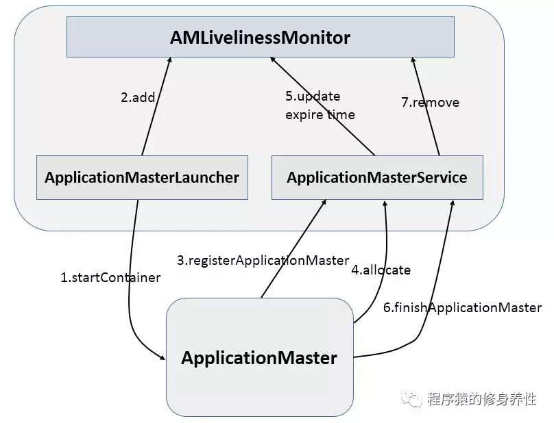

# 特点
能够运行在廉价机器上，硬件出错常态，需要具备高容错性
流式数据访问，而不是随机读写
面向大规模数据集，能够进行批处理、能够横向扩展
简单一致性模型，假定文件是一次写入、多次读取
缺点：

不支持低延迟数据访问
不适合大量小文件存储（因为每条元数据占用空间是一定的）
不支持并发写入，一个文件只能有一个写入者
不支持文件随机修改，仅支持追加写入

block 
这个大家应该知道，文件上传前需要分块，这个块就是block，一般为128MB，当然你可以去改，不顾不推荐。因为块太小：寻址时间占比过高。块太大：Map任务数太少，作业执行速度变慢。它是最大的一个单位。

packet 
packet是第二大的单位，它是client端向DataNode，或DataNode的PipLine之间传数据的基本单位，默认64KB。

chunk 
chunk是最小的单位，它是client向DataNode，或DataNode的PipLine之间进行数据校验的基本单位，默认512Byte，因为用作校验，故每个chunk需要带有4Byte的校验位。所以实际每个chunk写入packet的大小为516Byte。由此可见真实数据与校验值数据的比值约为128 : 1。（即64*1024 / 512）

在client端向DataNode传数据的时候，HDFSOutputStream会有一个chunk buff，写满一个chunk后，会计算校验和并写入当前的chunk。之后再把带有校验和的chunk写入packet，当一个packet写满后，packet会进入dataQueue队列，其他的DataNode就是从这个dataQueue获取client端上传的数据并存储的。同时一个DataNode成功存储一个packet后之后会返回一个ack packet，放入ack Queue中

### 写
客户端向NameNode发出写文件请求。
检查是否已存在文件、检查权限。若通过检查，直接先将操作写入EditLog，并返回输出流对象。 
（注：WAL，write ahead log，先写Log，再写内存，因为EditLog记录的是最新的HDFS客户端执行所有的写操作。如果后续真实写操作失败了，由于在真实写操作之前，操作就被写入EditLog中了，故EditLog中仍会有记录，我们不用担心后续client读不到相应的数据块，因为在第5步中DataNode收到块后会有一返回确认信息，若没写成功，发送端没收到确认信息，会一直重试，直到成功）
client端按128MB的块切分文件。
client将NameNode返回的分配的可写的DataNode列表和Data数据一同发送给最近的第一个DataNode节点，此后client端和NameNode分配的多个DataNode构成pipeline管道，client端向输出流对象中写数据。client每向第一个DataNode写入一个packet，这个packet便会直接在pipeline里传给第二个、第三个…DataNode。 
（注：并不是写好一个块或一整个文件后才向后分发）
每个DataNode写完一个块后，会返回确认信息。 
（注：并不是每写完一个packet后就返回确认信息，个人觉得因为packet中的每个chunk都携带校验信息，没必要每写一个就汇报一下，这样效率太慢。正确的做法是写完一个block块后，对校验信息进行汇总分析，就能得出是否有块写错的情况发生）
写完数据，关闭输输出流。
发送完成信号给NameNode。 
（注：发送完成信号的时机取决于集群是强一致性还是最终一致性，强一致性则需要所有DataNode写完后才向NameNode汇报。最终一致性则其中任意一个DataNode写完后就能单独向NameNode汇报，HDFS一般情况下都是强调强一致性）

### 读

client访问NameNode，查询元数据信息，获得这个文件的数据块位置列表，返回输入流对象。
就近挑选一台datanode服务器，请求建立输入流 。
DataNode向输入流中中写数据，以packet为单位来校验。
关闭输入流
### data dir
in_use.lock表示DataNode正在对文件夹进行操作 
rbw是“replica being written”的意思，该目录用于存储用户当前正在写入的数据。 
Block元数据文件（*.meta）由一个包含版本、类型信息的头文件和一系列校验值组成。校验和也正是存在其中。

## yarn HA
ResourceManager HA 由一对Active，Standby结点构成，通过RMStateStore存储内部数据和主要应用的数据及标记。
目前支持的可替代的RMStateStore实现有：基于内存的MemoryRMStateStore，基于文件系统的FileSystemRMStateStore，及基于zookeeper的ZKRMStateStore。
ResourceManager HA的架构模式同NameNode HA的架构模式基本一致，数据共享由RMStateStore，而ZKFC成为 ResourceManager进程的一个服务，非独立存在。

# 环境准备
[ClusterSetup](http://hadoop.apache.org/docs/stable/hadoop-project-dist/hadoop-common/ClusterSetup.html)
```sh
useradd pmz
passwd pmz
redhat
visudo （/etc/sudoers）
# %pmz ALL=(ALL) NOPASSWD: ALL

1. 修改主机名和解析
vi /etc/sysconfig/network
NETWORKING=yes
HOSTNAME=hadoop-master
2. 关闭selinux/防火墙
3. ntp 和 ulimit
4. ssh免密登录
5. jdk 和Hadoop
getenforce

sudo yum install -y ntp

\cp /usr/share/zoneinfo/Asia/Shanghai /etc/localtime


echo "* * */4 * *  /usr/sbin/ntpdate cn.pool.ntp.org > /dev/null 2>&1" >> /var/spool/cron/root


设置root直连
#vi /etc/ssh/sshd_config
添加PermitRootLogin yes
service sshd restart

ssh-keygen 一路回车
ssh-copy-id h189 然后输入h189的ssh密码
ssh h189 免密登录
免密另外的两台

或者
cat ~/.ssh/id_rsa.pub >> ~/.ssh/authorized_keys

生成rsa密钥，A TO B(root@guard1)  在A执行，A登录B时，不需输入密码
1、ssh-keygen -t rsa -P ''
2、ssh-copy-id -i ~/.ssh/id_rsa.pub  root@guard1

传文件，执行shell
scp -r zookeeper-3.4.5-cdh5.7.0/ node3:/home/hadoop/
ssh node2 "echo 2 > /home/hadoop/zookeeper-3.4.5-cdh5.7.0/myid"
ssh node2 "/home/hadoop/zookeeper-3.4.5-cdh5.7.0/bin/zkServer.sh start"

hadoop-env.sh yarn-env.sh mapred-env.sh配置环境变量（每台机器都要设置）
export JAVA_HOME=/usr/local/jdk1.8.0_73 

slaves文件是指定HDFS上有哪些DataNode节点，Master主机特有。

创建 tmp name data 目录
mkdir -p /home/data/hadoopdata/tmp
mkdir -p /home/data/hadoopdata/nn
mkdir -p /home/data/hadoopdata/journalnode/
mkdir -p /home/data/hadoopdata/dn
# core-site.xml

<!-- 指定hdfs的nameservice为myha01 -->
	<property>
		<name>fs.defaultFS</name>
		<value>hdfs://myha01</value>
	</property>
 
	<!-- 指定hadoop临时目录 -->
	<property>
		<name>hadoop.tmp.dir</name>
		<value>/home/hadoop/data/hadoopdata</value>
	</property>
	<property> 
		<name>fs.trash.interval</name> 
		<value>1440</value> 
		<description>Number of minutes between trash checkpoints. If zero, the trash feature is disabled. 
		</description> 
	</property>
	<property>
      <name>io.compression.codecs</name>
      <value>
  org.apache.hadoop.io.compress.GzipCodec,
  org.apache.hadoop.io.compress.DefaultCodec,
  org.apache.hadoop.io.compress.BZip2Codec,
  org.apache.hadoop.io.compress.SnappyCodec
      </value>
  </property>
	<!-- 指定zookeeper地址 -->
	<property>
		<name>ha.zookeeper.quorum</name>
		<value>potter2:2181,potter3:2181,potter4:2181,potter5:2181</value>
	</property>
 
	<!-- hadoop链接zookeeper的超时时长设置 -->
	<property>
		<name>ha.zookeeper.session-timeout.ms</name>
		<value>1000</value>
		<description>ms</description>
	</property>
	<!-- hadoop.proxyuser.hadoop.hosts 配置成*的意义，表示任意节点使用 hadoop 集群的代理用户 hadoop/root都能访问 hdfs 集群，hadoop.proxyuser.hadoop.groups 表示代理用户的组所属>
<property>
 <name>hadoop.proxyuser.hadoop.hosts</name>
 <value>*</value>
</property>
<property>
 <name>hadoop.proxyuser.hadoop.groups</name>
 <value>*</value>
</property>

# hdfs-site.xml
<configuration>
 <property>
   <name>dfs.namenode.secondary.http-address</name>
   <value>master:50090</value>
 </property>

 <property>
   <name>dfs.suppeort.append</name>
   <value>true</value>
 </property>

<!-- 指定副本数 -->
<property>
	<name>dfs.replication</name>
	<value>2</value>
</property>

<!-- 配置namenode和datanode的工作目录-数据存储目录 -->
<property>
	<name>dfs.namenode.name.dir</name>
	<value>/home/hadoop/data/hadoopdata/dfs/name</value>
</property>
<property>
	<name>dfs.datanode.data.dir</name>
	<value>/home/hadoop/data/hadoopdat/dfs/data</value>
</property>

<!-- 启用webhdfs -->
<property>
	<name>dfs.webhdfs.enabled</name>
	<value>true</value>
</property>

<!--
指定hdfs的nameservice为myha01，需要和core-site.xml中的保持一致.	dfs.ha.namenodes.[nameservice id]为在nameservice中的每一个NameNode设置唯一标示符。s配置一个逗号分隔的NameNode ID列表。这将是被DataNode识别为所有的NameNode。例如，如果使用"myha01"作为nameservice ID，并且使用"nn1"和"nn2"作为NameNodes标示符 
-->
<property>
	<name>dfs.nameservices</name>
	<value>myha01</value>
</property>

<!-- myha01下面有两个NameNode，分别是nn1，nn2 -->
<property>
	<name>dfs.ha.namenodes.myha01</name>
	<value>nn1,nn2</value>
</property>

<!-- nn1的RPC通信地址 -->
<property>
	<name>dfs.namenode.rpc-address.myha01.nn1</name>
	<value>potter2:9000</value>
</property>

<!-- nn1的http通信地址 -->
<property>
	<name>dfs.namenode.http-address.myha01.nn1</name>
	<value>potter2:50070</value>
</property>

<!-- nn2的RPC通信地址 -->
<property>
	<name>dfs.namenode.rpc-address.myha01.nn2</name>
	<value>potter3:9000</value>
</property>

<!-- nn2的http通信地址 -->
<property>
	<name>dfs.namenode.http-address.myha01.nn2</name>
	<value>potter3:50070</value>
</property>

<!-- 指定NameNode的edits元数据的共享存储位置。也就是JournalNode列表。该url的配置格式：qjournal://host1:port1;host2:port2;host3:port3/journalId。journalId推荐使用nameservice，默认端口号是：8485 -->
<property>
	<name>dfs.namenode.shared.edits.dir</name>
	<value>qjournal://potter2:8485;potter3:8485;potter4:8485/myha01</value>
</property>

<!-- 指定JournalNode在本地磁盘存放数据的位置 -->
<property>
	<name>dfs.journalnode.edits.dir</name>
	<value>/home/potter/data/journaldata</value>
</property>

<!-- 开启NameNode失败自动切换 -->
<property>
	<name>dfs.ha.automatic-failover.enabled</name>
	<value>true</value>
</property>

<!-- 配置失败自动切换实现方式 -->
<property>
	<name>dfs.client.failover.proxy.provider.myha01</name>
	<value>org.apache.hadoop.hdfs.server.namenode.ha.ConfiguredFailoverProxyProvider</value>
</property>

<!-- 配置隔离机制方法，多个机制用换行分割，即每个机制暂用一行 -->
<property>
	<name>dfs.ha.fencing.methods</name>
	<value>
		sshfence([[username][:port]])
	</value>
</property>
<!-- 使用sshfence隔离机制时需要ssh免登陆 -->
<property>
	<name>dfs.ha.fencing.ssh.private-key-files</name>
	<value>/home/potter/.ssh/id_rsa</value>
</property>
<!-- 配置sshfence隔离机制超时时间 -->
<property>
	<name>dfs.ha.fencing.ssh.connect-timeout</name>
	<value>30000</value>
</property>
<property>
	<name>ha.failover-controller.cli-check.rpc-timeout.ms</name>
	<value>60000</value>
</property>
<!-- Java不能直接操作Unix Domain Socket，所以需要安装Hadoop的native包libhadoop.so-->
<property>
  <name>dfs.client.read.shortcircuit</name>
  <value>true</value>
</property>
<property>
    <name>dfs.domain.socket.path</name>
    <value>/var/lib/hadoop-hdfs/dn_socket</value>
</property>
<!-- Timeout (in seconds) for the parallel RPCs made in DistributedFileSystem#getFileBlockStorageLocations().-->
<!--Block Location Tracking 块位置追踪-->
<property>
  <name>dfs.client.file-block-storage-locations.timeout.millis</name>
  <value>10000</value>
</property>
<property>
 <name>dfs.datanode.hdfs-blocks-metadata.enabled</name>
 <value>true</value>
</property> 
<property>
      <name>mapreduce.map.output.compress</name> 
      <value>true</value>
  </property>
  <property>
      <name>mapreduce.map.output.compress.codec</name>
      <value>org.apache.hadoop.io.compress.SnappyCodec</value>
  </property>

  <property>
      <name>mapreduce.output.fileoutputformat.compress</name>
      <value>true</value>
  </property>

  <property>
      <name>mapreduce.output.fileoutputformat.compress.codec</name>
      <value>org.apache.hadoop.io.compress.SnappyCodec</value>
  </property>
  <property>
      <name>mapred.output.compression.codec</name>
      <value>org.apache.hadoop.io.compress.SnappyCodec</value>
  </property>
  		<name>dfs.datanode.du.reserved</name>
        <!-- cluster variant -->
        <value>0</value>
        <description>Reserved space in bytes per volume. Always leave this much space free for non dfs use.tune2fs  -m 1 /dev/diskname
        </description>
   </property>

</configuration>

fs.defaultFS = hdfs://hadoop02:9000
解答：客户单访问HDFS集群所使用的URL地址(NameNode的地址)

同时，HDFS提供了一个web管理界面 端口：50070

访问hdfs的管理界面
192.168.213.101:50070


# yarn

访问yarn的管理界面
192.168.213.101:8088

# mapred-site.xml.template复制一个mapred-site.xml文件
#mapreduce.framework.name设置mapreduce任务运行在yarn上。mapreduce.jobhistory.address是设置mapreduce的历史服务器安装在BigData01机器上。mapreduce.jobhistory.webapp.address是设置历史服务器的web页面地址和端口号。
<configuration>
    <property>
        <name>mapreduce.framework.name</name>
        <value>yarn</value>
    </property>
    <property>
        <name>mapreduce.jobhistory.address</name>
        <value>bigdata-senior01.chybinmy.com:10020</value>
    </property>
    <property>
        <name>mapreduce.jobhistory.webapp.address</name>
        <value>bigdata-senior01.chybinmy.com:19888</value>
    </property>
</configuration>


# yarn-site.xml

<configuration>
	<!-- 开启RM高可用 -->
	<property>
		<name>yarn.resourcemanager.ha.enabled</name>
		<value>true</value>
	</property>
 
	<!-- 指定RM的cluster id -->
	<property>
		<name>yarn.resourcemanager.cluster-id</name>
		<value>yrc</value>
	</property>
 
	<!-- 指定RM的名字 -->
	<property>
		<name>yarn.resourcemanager.ha.rm-ids</name>
		<value>rm1,rm2</value>
	</property>
 
	<!-- 分别指定RM的地址 -->
	<property>
		<name>yarn.resourcemanager.hostname.rm1</name>
		<value>potter4</value>
	</property>
 
	<property>
		<name>yarn.resourcemanager.hostname.rm2</name>
		<value>potter5</value>
	</property>
 
	<!-- 指定zk集群地址 -->
	<property>
		<name>yarn.resourcemanager.zk-address</name>
		<value>potter2:2181,potter3:2181,potter4:2181</value>
	</property>
 
	<property>
		<name>yarn.nodemanager.aux-services</name>
		<value>mapreduce_shuffle</value>
	</property>
<!--
启动 mapreduce 任务历史服务器

历史服务器的Web端口默认是19888，可以查看Web界面
sbin/mr-jobhistory-daemon.sh start historyserver
#重启HistoryServer进程：
sbin/mr-jobhistory-daemon.sh stop historyserver
sbin/mr-jobhistory-daemon.sh start historyserver
http://hadoop102:19888/jobhistory
MapReduce是在各个机器上运行的，在运行过程中产生的日志存在于各个机器上，为了能够统一查看各个机器的运行日志，将日志集中存放在HDFS上，这个过程就是日志聚集。
配置日志聚集功能：Hadoop默认是不启用日志聚集的。在yarn-site.xml文件里配置启用日志聚集。
-->
	<property>
		<name>yarn.log-aggregation-enable</name>
		<value>true</value>
	</property>
 
	<property>
		<name>yarn.log-aggregation.retain-seconds</name>
		<value>86400</value>
	</property>
 
	<!-- 启用自动恢复 -->
	<property>
		<name>yarn.resourcemanager.recovery.enabled</name>
		<value>true</value>
	</property>
 
	<!-- 制定resourcemanager的状态信息存储在zookeeper集群上 -->
	<property>
		<name>yarn.resourcemanager.store.class</name>
		<value>org.apache.hadoop.yarn.server.resourcemanager.recovery.ZKRMStateStore</value>
	</property>


	<property>
		<name>yarn.nodemanager.vmem-check-enabled</name>
		<value>false</value>
		<description>Whether virtual memory limits will be enforced for containers</description>
    </property>
    <property>
		<name>yarn.nodemanager.vmem-pmem-ratio</name>
		<value>4</value>
		<description>Ratio between virtual memory to physical memory when setting memory limits for containers</description>
    </property>
</configuration>

export JAVA_HOME=/usr/java/jdk1.8.0_162
export ZK_HOME=/home/hadoop/zookeeper-3.4.5-cdh5.7.0
export HADOOP_HOME=/home/hadoop/hadoop-2.6.0-cdh5.7.0
export YARN_HOME=/home/hadoop/hadoop-2.6.0-cdh5.7.0
export PATH=$JAVA_HOME/bin:$JAVA_HOME/jre/bin:$ZK_HOME/bin:$HADOOP_HOME/bin:$HADOOP_HOME/sbin:$PATH

如果需要重新格式化NameNode,需要先将原来NameNode和DataNode下的文件全部删除，不然会报错，NameNode和DataNode所在目录是在core-site.xml中hadoop.tmp.dir、dfs.namenode.name.dir、dfs.datanode.data.dir属性配置的。
因为每次格式化，默认是创建一个集群ID，并写入NameNode和DataNode的VERSION文件中（VERSION文件所在目录为dfs/name/current 和 dfs/data/current），重新格式化时，默认会生成一个新的集群ID,如果不删除原来的目录，会导致namenode中的VERSION文件中是新的集群ID,而DataNode中是旧的集群ID，不一致时会报错。另一种方法是格式化时指定集群ID参数，指定为旧的集群ID。

hadoop version

hdfs fsck /passwd -files -blocks -locations

# ha 启动步骤
[ha 参考](https://www.willxu.xyz/2018/12/29/project/5%E3%80%81ha%E5%AE%9E%E7%8E%B0/)
1. zk 启动

2. 启动 journalnode 在每个要运行的机器上执行
hadoop-daemon.sh start journalnode

3. bin/hdfs namenode -format
#格式化是对HDFS这个分布式文件系统中的DataNode进行分块，统计所有分块后的初始元数据的存储在NameNode中。格式化后，查看core-site.xml里hadoop.tmp.dir指定的目录下是否有了dfs目录，如果有，说明格式化成功。注意：格式化时，这里注意hadoop.tmp.dir目录的权限问题，应该hadoop普通用户有读写权限才行，可以将/opt/data的所有者改为hadoop。
在nn1上执行hadoop-daemon.sh start namenode

如果是全新的HDFS集群，这个时候直接hdfs namenode -format格式化即可
已经格式化或是从非HA设置为HA的集群，需要把格式化后的NameNode节点的数据拷贝到未格式化节点上。未格式化NameNode节点执行hdfs namenode -bootstrapStandby命令 同步集群ID到第二台namenode。
如果是从非HA到HA的配置，需要执行hdfs namenode -initializeSharedEdits将原有的NameNode日志写入JournalNode中。

nn2 启动
sbin/hadoop-daemon.sh start namenode


4. 只能在nameonde节点进行,第一次使用zkfc需要格式化
hdfs zkfc -formatZK

启动zkfc在nn1和nn2分别启动hadoop-daemon.sh start zkfc,这时两个一个变成active,一个变成standby

在任何机器上执行hdfs haadmin -getServiceState host 可查看HA状态

5.重启start-dfs(不管在集群中的那个节点都可以

),start-yarn(只能在主节点中进行启动)

6. 另外一个resourcemanager必须手动启动，yarn-daemon.sh start resourcemanager

7、查看各主节点的状态

HDFS: 

hdfs haadmin -getServiceState nn1 

hdfs haadmin -getServiceState nn2

hdfs haadmin -transitionToActive nn1

YARN: 

yarn rmadmin -getServiceState rm1 

yarn rmadmin -getServiceState rm2

#将配置文件分发到其他节点
#重启Yarn进程：
sbin/stop-yarn.sh
sbin/start-yarn.sh


hdfs getconf -confKey dfs.client.file-block-storage-locations.timeout

hdfs dfs -help rm
hdfs dfsadmin -help refreshNodes
yarn rmadmin -help
/bin/hdfs dfs -mkdir -p /demo1
/bin/hdfs dfs -put 

hadoop fs -getmerge /user/atguigu/test/* ./zaiyiqi.txt

${HADOOP_HOME}/etc/hadoop/core-site.xml /demo1

/bin/hdfs dfs -cat /demo1/core-site.xml
bin/hdfs dfs -get /demo1/core-site.xml localDestDir
hdfs dfs -cp /xxx/xxx /xxx/xxx
hdfs dfs -chmod -R 777 /xxx
hdfs dfs -chown -R zyh:zyh /xxx
hdfs dfsadmin -safemode get
hadoop fs - appendToFile file:/test.txt hdfs:/newfile.txt #读取本地文件内容追加到HDFS文件

/hadoop distcp hdfs://haoop102:9000/user/atguigu/hello.txt hdfs://hadoop103:9000/user/atguigu/hello.txt


11)改变文件副本数 setrep
hadoop fs -setrep -R -w 2 /test.txt
-R 递归改变目录下所有文件的副本数。
-w 等待副本数调整完毕后返回。可理解为加了这个参数就是阻塞式的了。

hadoop fs -du / #显示HDFS根目录中各文件和文件夹大小
hadoop fs -du -h / #以最大单位显示HDFS根目录中各文件和文件夹大小
hadoop fs -du -s / #仅显示HDFS根目录大小。即各文件和文件夹大小之和
## 单独命令
/sbin/hadoop-daemon.sh start namenode
/sbin/hadoop-daemon.sh start datanode
/sbin/hadoop-daemon.sh start secondarynamenode

/sbin/yarn-daemon.sh start resourcemanager
/sbin/yarn-daemon.sh start nodemanager
相应的命令是stop


sbin : 启动或停止Hadoop相关服务的脚本
bin ：对Hadoop相关服务（HDFS,YARN）进行操作的脚本
etc : Hadoop的配置文件目录
share ：Hadoop的依赖jar包和文档，文档可以被删掉
lib ：Hadoop的本地库（对数据进行压缩解压缩功能的）

HDFS动态扩容
查看现在DataNode情况可以在Hadoop的bin目录下执行./hdfs dfsadmin -report，可以看到存活的DataNode。现在为3个。
下面为扩容的具体步骤：

准备一台新的服务器（最好是跟原集群的机器相同配置）
为新的服务器准备系统环境（主机名、IP地址、防火墙、JDK环境、hosts文件）
将新的服务器连入原集群网络（测试是否可以ping通）
从原集群中拷贝一个hadoop的安装目录到新节点上，并且删除原datanode的工作目录（这里配置的为tmp目录）
修改/bigdata/hadoop-2.6.5/etc/hadoop/slaves 文件，加入新节点的主机名
在新节点上用命令：hadoop-daemon.sh start datanode 启动datanode，就会自动加入集群

Configured Capacity = 磁盘可用空间 - Reserved Space
而 Reserved Space 由HDFS的配置hdfs-site.xml中的 dfs.datanode.du.reserved 设定（单位byte）
磁盘可用空间则不是整个节点的磁盘大小，而是datanode数据挂载目录的分配空间（datanode数据目录由 hdfs-site.xml中 dfs.datanode.data.dir设定）

Configured Capacity : hadoop设置的总空间大小
DFS Used ： hadoop文件系统所使用的空间
Non DFS Used ： 非hadoop文件系统所使用的空间大小，比如说本身的linux系统使用的，或者存放的其它文件
DFS Remaining ：hadoop文件系统可使用的剩余容量大小

重启start-dfs(不管在集群中的那个节点都可以

),start-yarn(只能在主节点中进行启动)

hadoop集群恢复终极解决方案

在每一台机器上用命令杀掉所有java进程：  killall java
在每一台机器上删掉hadoop安装目录中的tmp文件夹
在node-1上格式化namenode：   hadoop namenode -format -clusterid mycluster
在node-1上执行脚本来启动整个集群：  start-dfs.sh start-yarn.sh
注意用这种方案会重新格式化hdsf，意味着原来上传的文件会全部丢失！！！
补充：关闭HDFS集群的命令：在node-1上：  stop-dfs.sh
关闭YARN集群的命令：在node-1上：  stop-yarn.sh


hadoop 重启

sbin/stop-all.sh
sbin/start-all.sh


```


# 配置和原理
在检查点期间，Editlog 的更改将应用于 FsImage。可以以秒为单位的给定时间间隔（dfs.namenode.checkpoint.period）触发检查点，或者在累积给定数量的文件系统事务（dfs.namenode.checkpoint.txns）之后触发检查点。如果同时设置了这两个属性，则一旦满足其中一个阈值就可触发检查点。


HDFS中的文件是一次写入的，并且在任何时候都只能有一个写入器。


由于 NameNode 不允许 DataNode 具有同一块的多个副本，因此，能创建的最大副本数是此时 DataNode 的总数。


当有客户端请求读取时，HDFS 为了最小化全局带宽消耗与读取延迟，会优先选择离读取客户端最近的数据副本。


DataNode 是从流水线中的前一个接收数据，同时将数据转发到流水线中的下一个，数据是从一个 DataNode 流水线到下一个 DataNode


会发现这里有两种命令前缀，一个是 hadoop fs，一个是 hdfs dfs

区别是：hadoop fs 可以用于其他文件系统，不止是hdfs文件系统内，也就是说该命令的使用范围更广；而 hdfs dfs 专门针对hdfs分布式文件系统。

启用了垃圾箱配置，想直接彻底删除，命令为：hadoop fs -rmr -skipTrash a.txt

### 回收站机制
在HDFS里，删除文件时，不会真正的删除，其实将数据move到/user/${username}/.Trash/current，回收站里的文件可以快速恢复。当启用垃圾回收并删除一些文件时，HDFS容量不会增加，因为文件并未真正删除。HDFS不会回收空间，除非文件从回收站中删除，只有在检查点过期后才会发生.回收站功能默认只适用于使用Hadoop shell删除的文件和目录。使用其他接口(例如WebHDFS或Java API)以编程的方式删除的文件或目录不会移动到回收站，即使已启用回收站，除非程序已经实现了对回收站功能的调用。回收站中的文件和目录可以简单地通过将它们移动到.Trash目录之外的位置来恢复。默认是关闭的，core-site.xml
```sh
<property> 
<name>fs.trash.interval</name> 
<value>1440</value> 
<description>Number of minutes between trash checkpoints. If zero, the trash feature is disabled. 
</description> 
</property>

fs.trash.interval = 360 (deletion interval = 6 hours)
fs.trash.checkpoint.interval = 60 (emptier interval = 1 hour)


Trash trash = New Trash(conf);
trash.moveToTrash(path);

这导致NameNode为Current目录下的垃圾文件每小时创建一个新的检查点，并删除已经存在超过6个小时的检查点。

存放位置
hadoop fs -ls /user/hadoop/.Trash/Current/

查看hdfs存储空间使用情况
hadoop dfsadmin -report

查看回收站占用空间及内容
hadoop dfs -du -h /user/hadoop/.Trash/
hadoop fs -ls /user/hadoop/.Trash/Current/
hadoop dfs -ls /user/hadoop/.Trash/

清空回收站
删除.Trash目录
hadoop fs -rmr .Trash
hadoop fs -rmr .Trash  
hadoop dfs -rmr /user/hadoop/.Trash/*

清空回收站命令（经测试，基本没用）
hdfs dfs -expunge 
bin/hadoop fs -expunge
bin/hadoop dfs -ls .Trash/Current/user/grid

hive的表及分区删除，如果回收站功能启用，实际上也是将文件放到回收站的。如果想快速利用空间，实际上也要进行手工清空回收站操作。目前，没有找到删除hive表不进入回收站的方法
```

## hdfs 2 
在HDFS中，任何block，文件或者目录在内存中均以对象的形式存储，每个对象约占150byte，如果有10000000个小文件，每个文件占用一个block，则namenode需要2G空间。如果存储1亿个文件，则namenode需要20G空间。这样namenode内存容量严重制约了集群的扩展。

Namenode进程的JVM配置: HADOOP_NAMENODE_OPTS  
Datanode进程的JVM配置:HADOOP_DATANODE_OPTS  
client命令行的JVM配置:HADOOP_CLIENT_OPTS  

在任何时间，JNs只允许一个 NN充当writer。在故障恢复期间，将要变成Active 状态的NN将取得writer的角色，并阻止另外一个NN继续处于Active状态

在HA集群中，Standby NN也执行namespace状态的checkpoints，所以不必要运行Secondary NN,集群中提供多个NameNode，每个NameNode负责管理一部分DataNode

1、针对NameNode这种关键节点需要可以增加监控，包括fsimage合并更新时间检测等；
2、调整hdfs-site.xml中参数：
增加往journalnode写入editlog超时时间。
dfs.qjournal.write-txns.timeout.ms (journalnode 写入超时时间：默认是20s)，可以调整为：60s
3、在hadoop-env.sh中namenode opts中增加gc日志：
HADOOP_NAMENODE_OPTS配置项来调整，显示制定gc收集方式：
export HADOOP_NAMENODE_OPTS="-Xmx10G -XX:+UseG1GC -XX:MaxGCPauseMillis=200 -XX:+
UnlockExperimentalVMOptions -XX:+ParallelRefProcEnabled -XX:-ResizePLAB -XX:+PerfDisableSharedMem -XX:-OmitStackTraceInFastThrow -XX:G1NewSizePercent=2 -XX:ParallelGCThreads=23 -XX:InitiatingHeapOccupancyPercent=40 -XX:G1HeapRegionSize=32M -XX:G1HeapWastePercent=10 -XX:G1MixedGCCountTarget=16 -verbose:gc -XX:+PrintGCDetails -XX:+PrintGCDateStamps -XX:+PrintGCTimeStamps -XX:+UseGCLogFileRotation -XX:NumberOfGCLogFiles=5 -XX:GCLogFileSize=100M -Xloggc:$HADOOP_LOG_DIR/gc.log-date +'%Y%m%d%H%M' -Dhadoop.security.logger=
${HADOOP_SECURITY_LOGGER:-INFO,RFAS} -Dhdfs.audit.logger=${HDFS_AUDIT_LOGGER:-INFO,
NullAppender} $HADOOP_NAMENODE_OPTS"

### HDFS快照是一个只读的基于时间点文件系统拷贝
• 快照创建是即时的：除了inode查找时间之外，成本是O（1）。

仅当对快照进行修改时才使用额外的内存：内存使用量为O（M），其中M为已修改文件/目录的数量。

DataNode中的块不会被复制：快照文件记录块列表和文件大小。 不进行数据复制。 
• 常用来作为数据备份，防止用户错误操作和容灾恢复。
• Snapshot 并不会影响HDFS 的正常操作：修改会按照时间的反序记录，这样可以直接读取到最新的数据。 
• 快照数据是当前数据减去修改的部分计算出来的。 
• 快照会存储在snapshottable的目录下。

HDFS快照是对目录进行设定，是某个目录的某一个时刻的镜像
• 对于一个snapshottable文件夹，“.snapshot” 被用于进入他的快照 /foo 是一个snapshottable目录，/foo/bar是一个/foo下面的文件目录，/foo有一个快照s0，那么路径就是/foo/.snapshot/s0/bar  
hdfs lsSnapshottableDir      
恢复快照  
hdfs dfs -cp -p /foo/.snapshot/s0/bar /tmp  
使用preserve选项来保留timestamps, ownership, permission, ACLs 和 Attrs  
• hdfs dfsadmin -allowSnapshot /user/spark  
• hdfs dfs -createSnapshot /user/spark s0  
• hdfs dfs -renameSnapshot /user/spark s0 s_init  
hdfs snapshotDiff 路径1 路径2 （功能描述：比较两个快照目录的不同之处）
• hdfs dfs -deleteSnapshot /user/spark s_init  
• hdfs dfsadmin -disallowSnapshot /user/spark  

hdfs snapshotDiff <path> <fromSnapshot> <toSnapshot>

http://cxy7.com/articles/2017/06/28/1498653617567.html

### Centralized Cache Management
https://www.jianshu.com/p/a91edfed9a31

dfs.datanode.max.locked.memory
确定每个DataNode给缓存使用的最大内存量

(1). addDirective：添加指令

hdfs cacheadmin -addDirective -path path -pool pool-name [-force] [-replication replication] [-ttl time-to-live]

-path 添加的路径-pool 加入的缓冲池名称-force 不检查缓存池的资源限制-replication 要使用的副本数，默认为1-ttl 缓存指令可以保持多长时间。可以按照分钟，小时，天来指定，如30m，4h，2d。有效单位为[smhd]。“never”表示永不过期的指令。如果未指定该值，那么，缓存指令就不会过期。

hdfs cacheadmin -removeDirective id

hdfs cacheadmin -removeDirectives path

hdfs cacheadmin -listDirectives [-stats] [-path path] [-pool pool]

-stats 显示 列出基于path的缓存指令统计信息。

2 缓存池命令

hdfs cacheadmin -addPool name [-owner owner] [-group group] [-mode mode] [-limit limit] [-maxTtl maxTtl]

hdfs cacheadmin -modifyPool name [-owner owner] [-group group] [-mode mode] [-limit limit] [-maxTtl maxTtl]

其中，-owner/group是该pool的属主/组，默认为当前用户-mode是POSIX风格权限，默认为0755-limit为该pool中可以缓存的最大字节数，默认没有限制-maxTtl 最大的生存期，可以是120s, 30m, 4h, 2d等。

(2). 移除缓冲池：

cacheadmin -removePool name

(3). 列出缓冲池：

cacheadmin -listPools [-stats] [name]

-stats为显示统计信息


### H D F S A C L
* Hadoop从2.4.0开始支持
• 目前HDFS的权限控制与Linux一致，包括用户、用户组、其他用户组三类权限，这种方式有很大局限性
• 首先参数上要开启基本权限和访问控制列表功能
```xml
<!-- hdfs-site.xml -->
<property>
    <name>dfs.permissions.enabled</name>
    <value>true</value>
</property>
<property>
    <name>dfs.namenode.acls.enabled</name>
    <value>true</value>
</property>
```
* 常用命令：
```sh
hdfs dfs -setfacl -R|[--set <acl_spec> <path>]
hdfs dfs -setfacl –set user::rw-,user:hadoop:rw-,group::r–,other::r– /file
hadoop fs -getfacl /input/acl  
hdfs dfs -setfacl -R -m user:mapred:r-- /input/acl  
hdfs dfs -setfacl -x user:mapred /input/acl
hdfs dfs -setfacl -m default:user:hadoop:r-x /dir

-b: 删除基本ACL条目以外的所有条目。保留用户，组和其他条目以与权限位兼容。
-k: 删除默认ACL。default
-R: 以递归方式将操作应用于所有文件和目录。常用。
-m: 修改ACL。新条目将添加到ACL，并保留现有条目。常用。
-x: 删除指定的ACL条目。保留其他ACL条目。常用。
–set: 完全替换ACL，丢弃所有现有条目。 acl_spec必须包含用户，组和其他条目，以便与权限位兼容。
acl_spec: 逗号分隔的ACL条目列表。
path: 要修改的文件或目录。

hdfs dfs -getfacl [-R] <path>
# 用hdfs超级用户来设置acl
sudo -u hdfs hdfs dfs -setfacl -m user:hue:rwx /warehouse/tablespace/managed/hive
```
## mr
### MR中job参数及设置map和reduce的个数
```sh
 # map的个数
在map阶段读取数据前，FileInputFormat会将输入文件分割成split。split的个数决定了map的个数。
影响map个数，即split个数的因素主要有：
1）HDFS块的大小，即HDFS中dfs.block.size的值。如果有一个输入文件为1024m，当块为
256m时，会被划分为4个split；当块为128m时，会被划分为8个split。
2）文件的大小。当块为128m时，如果输入文件为128m，会被划分为1个split；当块为256m，
会被划分为2个split。
3）文件的个数。FileInputFormat按照文件分割split，并且只会分割大文件，即那些大小超过
HDFS块的大小的文件。如果HDFS中dfs.block.size设置为64m，而输入的目录中文件有100个，则
划分后的split个数至少为100个。
4）splitsize的大小。分片是按照splitszie的大小进行分割的，一个split的大小在没有设置的情况下，
默认等于hdfs block的大小。但应用程序可以通过两个参数来对splitsize进行调节。
# map个数的计算公式如下：

1，splitsize=max(minimumsize,min(maximumsize,blocksize))。
如果没有设置minimumsize和maximumsize，splitsize的大小默认等于blocksize
2，计算公式
计算过程可以简化为如下的公式，详细算法可以参照FileInputSplit类中的getSplits方法
total_split ;
for(file ：输入目录中的每个文件)
{
file_split = 1;
if(file.size>splitsize)
{
file_split=file_size/splitsize;
}
total_split+=file_split;
}

```

## java api
```xml
<!-- java api -->

<dependency>
    <groupId>org.apache.hadoop</groupId>
    <artifactId>hadoop-hdfs</artifactId>
    <version>2.4.0</version>
</dependency>
<dependency>
    <groupId>org.apache.hadoop</groupId>
    <artifactId>hadoop-mapreduce-client-jobclient</artifactId>
    <version>2.4.0</version>
</dependency>
<dependency>
    <groupId>org.apache.hadoop</groupId>
    <artifactId>hadoop-common</artifactId>
    <version>2.4.0</version>
</dependency>
```
## yarn
* 向 YARN 以 jar 包的方式提交作业  
hadoop jar jar包名 应用名 输入路径 输出路径


hadoop jar example.jar wordccount /input/hello.txt /output/helloCount.txt

bin/yarn jar share/hadoop/mapreduce/hadoop-mapreduce-examples-
2.5.0.jar wordcount /wordcountdemo/input /wordcountdemo/output 'dfs[a-z.]+'

yarn-daemon.sh start resourcemanager 在nn2上再启动一个yarn

yarn rmadmin -getServiceState host


yarn-daemon.sh start proxyserver

yarn application -kill jobid
hadoop job -kill jobid

### rm
* 应用程序管理器负责整个系统中所有应用程序，包括应用提交、与调度器协商资源以启动ApplicationMaster、监控ApplicationMaster运行状态并在失败时重新启动它
* 管理NodeManager，接收来自NodeManager的资源汇报信息，并向NodeManager下达管理命令（比如杀死Container等）；
* YARN提供了多种直接可用的调度器，比如FIFO，Fair Scheduler和Capacity Scheduler

### am
用户提交的每个应用程序均包含一个AM，主要功能包括：

* 与RM调度器协商以获取资源（用Container表示）；

* 将得到的任务进一步分配给内部的任务；

* 与NM通信以启动/停止任务；

* 监控所有任务运行状态，并在任务运行失败时重新为任务申请资源以重启任务。

* 当前YARN自带了两个AM实现，一个是用于演示AM编写方法的实例程序distributedshell，它可以申请一定数目的Container以并行运行一个Shell命令或者Shell脚本；另一个是运行MapReduce应用程序的AM——MRAppMaster。

* ApplicationMaster管理部分主要由三个服务构成，分别是ApplicationMaster Launcher、AMLivelinessMonitor和ApplicationMasterService，它们共同管理应用程序的ApplicationMaster的生存周期，am启动流程：


https://mp.weixin.qq.com/s/StTxnzbcVhTHmBC0BgbY2Q

### nm
一方面，它会定时地向RM汇报本节点上的资源使用情况和各个Container的运行状态；另一方面，它接收并处理来自AM的Container启动/停止等各种请求。
### Container
YARN会为每个任务分配一个Container，且该任务只能使用该Container中描述的资源。YARN仅支持CPU和内存两种资源，且使用了轻量级资源隔离机制Cgroups进行资源隔离。core 是虚拟概念
### 工作流程 
运行在YARN上的应用程序主要分为两类：短应用程序和长应用程序。其中，短应用程序是指一定时间内（可能是秒级、分钟级或小时级，尽管天级别或者更长时间的也存在，但非常少）可运行完成并正常退出的应用程序，比如MapReduce作业、Tez DAG作业等。长应用程序是指不出意外，永不停止运行的应用程序，通常是一些服务，比如Storm Service（主要包括Nimbus和Supervisor两类服务），HBase Service（包括Hmaster和RegionServer两类服务）等，而它们本身作为一个框架提供了编程接口供用户使用。尽管这两类应用程序作用不同，一类直接运行数据处理程序，一类用于部署服务（服务之上再运行数据处理程序），但运行在YARN上的流程是相同的。

### 容错
* RM挂掉：单点故障，新版本可以基于Zookeeper实现HA高可用集群，可通过配置进行设置准备RM，主提供服务，备同步主的信息，一旦主挂掉，备立即做切换接替进行服务
* NM挂掉：不止一个，当一个挂了，会通过心跳方式通知RM，RM将情况通知对应AM，AM作进一步处理
* AM挂掉：若挂掉，RM负责重启，其实RM上有一个RMApplicationMaster， 是AM的AM，上面保存已经完成的task，若重启AM，无需重新运行已经完成的
task
## hadoop-streaming
$HADOOP_HOME/bin/hadoop jar $HADOOP_HOME/share/hadoop/tools/lib/hadoop-streaming-2.6.5.jar [genericOptions] [streamingOptions]

在这行命令中，其实是有先后顺序的，我们一定要保证[genericOptions]写在[streamingOptions]之前，否则hadoop streaming命令将失效。

常用的genericOptions如下：

-D property=value 指定额外的配置信息变量，详情在后文介绍
-files file1,file2,... 指定需要拷贝到集群节点的文件，格式以逗号分隔，通常为我们自己编写的mapper和reducer脚本或可执行程序，因为你的mapper和reducer通常要由集群中不同的节点来执行，而很可能你的脚本或可执行程序仅仅存在于你提交任务时所用的那个节点，因此遇到这种情况便需要将它们分发出去，-files其后的参数用不用引号括起来都可以。
常用的streamingOptions如下：

-file filename 指定需要拷贝到集群节点的文件，与-files的功能类似，只不过如果使用-file的话，就需要一个文件一个文件地去上传，比方说如果我要将我的mapper.py，reducer.py上传到集群上去运行，那就得需要两个-file参数。而在实际使用-file时，hadoop似乎并不希望我们使用-file参数，比如如下这条warning。“18/03/26 20:17:40 WARN streaming.StreamJob: -file option is deprecated, please use generic option -files instead.”  
-input myInputDirs 指定给mapreduce任务输入的文件位置，通常为hdfs上的文件路径，多个文件或目录用逗号隔开  
-output myOutputDir 指定给mapreduce任务输出的目录，通常为hdfs上的文件路径。  
-mapper executable or JavaClassName 用于mapper的可执行程序或java类，如果是脚本文件，应该以命令行完整调用的格式作为可执行程序参数并且须加引号，比如-mapper "python mapper.py"   
-reducer executable or JavaClassName 用于reducer的可执行程序或java类，要求同上  
-partitionerJavaClassName 自定义的partitionerjava类  
-combiner streamingCommandor JavaClassName 自定义的combiner类或命令  
常用的-D property=value如下：

-D mapred.job.name=jobname 指定作业名称
-D mapred.map.tasks=numofmap 每个Job运行map task的数量
-D mapred.reduce.tasks=numofreduce 每个Job运行reduce task的数量，如果指定为0，则意味着提交了一个map only的任务
-D stream.map.input.field.separator 指定map输入时的分隔符，默认为"\t"
-D stream.map.output.field.separator 指定map输出时使用的key/value分隔符，默认为"\t"，比如在我们的mapper中，输出key/value pairs的标准输出语句很可能是这样的 sys.stdout.write("%s,%s\n"%(birthyear,gender))，由于使用了非默认的分隔符，因此需要额外指定分隔符","。
-D stream.reduce.input.field.separator 指定reduce输入时的分隔符，默认为"\t"
-D stream.reduce.output.field.separator 指定reduce输入时的分隔符，默认为"\t"
-D stream.num.map.output.key.fields=num 指定map输出中第几个分隔符作为key和value的分隔点，默认为1    
-D stream.num.reduce.output.fields=num 指定reduce输出中第几个分隔符作为key和value的分隔点，默认为1
-D stream.non.zero.exit.is.failure=false/true 指定当mapper和reducer未返回0时，hadoop是否该认为此任务执行失败。默认为true。当mapper和reducer的返回值不是0或没有返回值时，hadoop将认为该任务为异常任务，将被再次执行，默认尝试4次都不是0，整个job都将失败。因此，如果我们在编写mapper和reducer未返回0时，则应该将该参数设置为false，否则hadoop streaming任务将报出异常。
## hadoop checknative -a
出于性能和java实现的非可用性原因，Hadoop具有某些组件的本地实现。这些组件可在一个称为原生Hadoop库的单一动态链接本地库中使用。在*nix平台上，该库被命名为 libhadoop.so。

本地Hadoop库包括各种组件：

压缩编译码器 (bzip2, lz4, snappy, zlib)  
用于HDFS的本地IO实用工具和HDFS中的集中缓存管理  
CRC32校验和实现 openssl    

http://dl.bintray.com/sequenceiq/sequenceiq-bin/  

本地共享库

export  LD_LIBRARY_PATH=$LD_LIBRARY_PATH:$HADOOP_HOME/lib/native 

## hadoop  balance
hdfs dfsadmin -setBalancerBandwidth 104857600

https://www.cnblogs.com/xinfang520/p/10513848.html
https://blog.csdn.net/jiangshouzhuang/article/details/51879102

1、线上在使用hadoop，上传文件时，最好选择没有部署DataNode节点的节点；
2、如果线上已经出现了DataNode数据倾斜，建议如下解决方法：
建议开启hdfs balance，通过定时的balance缓解数据倾斜的问题。
使用balance注意事项：
1、根据官方建议，balance进程需要启动在相对空闲的服务器上；
2、对于一些大型的HDFS集群(随时可能扩容或下架服务器)，balance进程需要作为后台常驻进程


### QJM
https://blog.csdn.net/androidlushangderen/article/details/79335457


### 编程
https://www.cnblogs.com/zhangyinhua/p/7678704.html  
https://blog.csdn.net/HcJsJqJSSM/article/details/83418976  
[Hadoop各个服务端口列表](https://blog.csdn.net/u011563666/article/details/79026114)


### kerberos
* https://docs.cloudera.com/documentation/enterprise/5-8-x/topics/sg_authentication.html
* https://docs.cloudera.com/HDPDocuments/HDP2/HDP-2.6.3/bk_security/content/setting_up_kerberos_authentication_for_non_ambari_clusters.html
* https://my.oschina.net/OttoWu/blog/806814
* https://ieevee.com/tech/2016/06/07/kerberos-1.html
* http://dongxicheng.org/mapreduce-nextgen/hadoop-secure-impersonation/
* https://blog.csdn.net/weixin_40861707/article/details/81979474
* https://www.cnblogs.com/xiaodf/p/5968178.html
hdfs dfsadmin -refreshSuperUserGroupsConfiguration

yarn rmadmin -refreshSuperUserGroupsConfiguration


## 归档文件
https://hadoop.apache.org/docs/r3.1.3/hadoop-archives/HadoopArchives.html


## [yarn ha](http://hadoop.apache.org/docs/r2.7.2/hadoop-yarn/hadoop-yarn-site/ResourceManagerHA.html)